# Inside a Direct Lender's Book

## The Ares Capital Corporation private-credit portfolio, 2018Q3-2026Q2

**Scope and data statement.** This report describes one portfolio: the investment book of Ares Capital Corporation (ARCC), the largest publicly traded business development company, as disclosed in its own SEC 10-K and 10-Q filings. Every number in it was computed from a two-panel dataset built by parsing the Schedule of Investments and the balance sheet out of those filings: a quarter panel of 30 balance-sheet rows and a position panel of 31,067 position-quarter rows, covering 30 of the 34 calendar quarters between 2018Q1 and 2026Q2 (2018Q1, 2018Q2, 2019Q3 and 2022Q1 are absent). No market prices, no return series, no third-party credit ratings and no external interest-rate series enter the dataset. Because the sample is a single manager, this is a single-manager portfolio study read as a window on direct lending, not a measurement of the private-credit asset class. Where the text says "the book", it means ARCC's book. Nothing here should be generalised to other BDCs, to private credit funds, or to the market, and no statement in this report is a causal claim.

**How to read this report.**

- *Fair-value weighting.* Unless a line explicitly says otherwise, every share, mix, mark, yield and spread is weighted by reported fair value, with that quarter's own total fair value as the denominator. Equal-weighted quantities (borrower counts, position counts, position-size percentiles, the position-level interquartile ranges in Section 6) are labelled as such at the point of use. A fair-value share and a position-count share can differ materially: first lien is 59.1% of 2026Q2 fair value but 965 of 1,439 positions, 67.1% of that quarter's rows.
- *The two absent interior quarters.* 2019Q3 and 2022Q1 have no parsed filing in the panel. They are missing filings, not missing observations: the underlying filing failed the build's verification gate and was excluded rather than partially loaded. Nothing is interpolated or bridged across them anywhere in this report; every time series is drawn on the full calendar with a visible break, and every table simply has no row. Any period-over-period reading that spans one of those points is a six-month change, not a quarterly one. Three further quarters, 2022Q4, 2023Q4 and 2024Q4, carry a parser failure specific to the non-accrual footnote and are excluded from the non-accrual series only.
- *Coverage stamps.* Every exhibit carries a stamp of the form "Computed on X of Y rows (Z% of the window panel)", where Y is the size of the in-window panel the exhibit draws on (31,067 position rows or 30 quarter rows). The stamp is a disclosure of what the exhibit ran on, not a quality score. A low share can mean the exhibit is a deliberate single-quarter or single-instrument cut: the 2026Q2 maturity ladder reads 3.3% of the window panel because it is one quarter of the debt book, and it covers 99.95% of that quarter's debt-book fair value. Read the accompanying sentence, not the percentage alone.
- *What the rate exhibits cover.* Rate and spread fields are absent by construction on equity and preferred positions, which carry no coupon. Positions carrying both a usable spread and a usable all-in rate account for 71.7% of fair value pooled across the window (72.6% as an unweighted mean of the 30 quarterly shares, 60.7% of positions equal-weighted). Every yield and spread statistic in this report therefore describes roughly seven-tenths to eight-tenths of the book by value, and the excluded remainder is not random.

---

# 1. Executive summary

1. **The book roughly tripled while equity did not keep pace, so the balance sheet levered up.** Investments at fair value rose from $11.220bn in 2018Q3 to $29.349bn in 2026Q2, +161.6% or 13.21% per year compounded over the 7.75 elapsed years, while net assets rose 89.9% (8.63% per year) and debt to net assets went from 0.622x to 1.135x, peaking at 1.278x in 2022Q4.

2. **The portfolio rotated hard into first lien and out of second lien, but overall senior secured exposure fell.** First lien went from 44.1% of fair value in 2018Q3 to 59.1% in 2026Q2 (+14.9pp) and second lien from 29.9% to 4.4%, so first plus second lien combined fell from 74.0% to 63.5% as equity rose from 9.0% to 15.4%.

3. **Yields moved with the base-rate cycle, not with credit spreads, which compressed.** The fair-value-weighted all-in rate on the debt book fell to a 7.82% trough in 2021Q4, peaked at 12.20% in 2023Q3 and stood at 9.49% in 2026Q2, while the fair-value-weighted spread fell from 707bps in 2018Q3 to 570bps in 2026Q2, with a 568bps window trough in 2026Q1.

4. **First-lien pricing tightened and the compensation for going down the capital structure narrowed, though not in a straight line.** The pooled fair-value-weighted first-lien median spread is 565bps (p25 500bps, p75 640bps) and 525bps in 2026Q2, while the second-lien-minus-first-lien differential fell from 225bps in 2018Q3 to 150bps in 2026Q2, having touched 125bps in 2023Q2-Q3 and rebounded to 240bps in 2024Q4.

5. **Credit stress in this book is small in aggregate and severe where it lands.** The aggregate mark troughed at 92.77% of cost in 2020Q1 and was 98.90% in 2026Q2, non-accruals peaked at 5.06% of cost in 2020Q3 and were 2.38% of cost and 1.38% of fair value in 2026Q2, and over the latest eight quarters non-accrual debt positions were carried at 0.5839x cost against 0.9835x for accruing debt.

6. **Breadth rose, single-name concentration fell, and the sector mix moved decisively toward software and financials.** Distinct borrowers went from 313 in 2018Q3 to 593 in 2026Q2 while the top-10 borrower share of fair value fell from 25.55% to 22.43%; against a 2019Q4 base, Software and Services gained 9.09pp to 21.98% of fair value and Healthcare Equipment and Services lost 10.42pp to 9.86%.

---

# 2. Sample coverage and data quality

**Finding.** The panel covers 30 of the 34 calendar quarters from 2018Q1 to 2026Q2 with a complete, internally consistent balance sheet in every one of them, and the fields that identify a position (borrower, industry, type, cost, fair value, accrual flag) are 0% null; the entire data-quality problem in this dataset sits in the rate and term fields, and it is structural rather than random.

## 2.1 Which quarters exist

Four calendar quarters are absent from the 2018Q1-2026Q2 grid: 2018Q1 and 2018Q2 precede the first parsed filing, and 2019Q3 and 2022Q1 sit inside the window as genuine holes. Filings that failed the build's verification gate were excluded rather than partially loaded, so the panel's missingness is partly endogenous to the verification step; which specific check each of the two interior filings failed is not established by this analysis.

**Figure 1. Filing coverage: parsed quarters vs the calendar**

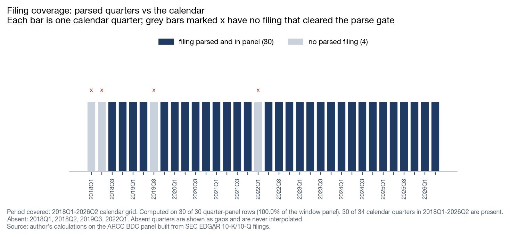

*Period covered: 2018Q1-2026Q2 calendar grid. Computed on 30 of 30 quarter-panel rows (100.0% of the window panel). 30 of 34 calendar quarters in 2018Q1-2026Q2 are present. Absent: 2018Q1, 2018Q2, 2019Q3, 2022Q1. Absent quarters are shown as gaps and are never interpolated.*

*Source: author's calculations on the ARCC BDC panel built from SEC EDGAR 10-K/10-Q filings.*

Position counts grew alongside the book, from 770 in 2018Q3 to 1,439 in 2026Q2, +86.9%, an 8.40% per year compound rate over 7.75 years computed on the two endpoints only. The series minimum is 745 in 2019Q4, below the 2018Q3 starting level, so the endpoint-based growth rate is flattered by the base quarter.

**Figure 2. Position count per quarter**

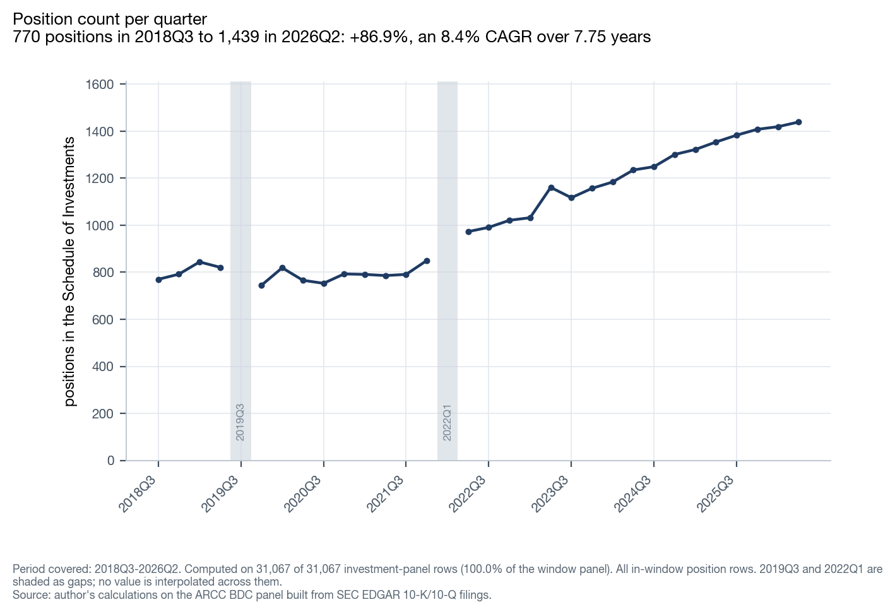

*Period covered: 2018Q3-2026Q2. Computed on 31,067 of 31,067 investment-panel rows (100.0% of the window panel). All in-window position rows. 2019Q3 and 2022Q1 are shaded as gaps; no value is interpolated across them.*

*Source: author's calculations on the ARCC BDC panel built from SEC EDGAR 10-K/10-Q filings.*

## 2.2 Field completeness

Fourteen columns are entirely non-null, including cost, fair value, borrower, industry, investment type and the non-accrual flag. Two columns must never be used: `pct_of_net_assets` is 100.00% null and `shares_units` is 81.46% null. The rate and term fields sit in between: `spread_bps` is 38.40% null, `reference_rate` and `all_in_rate_pct` are each 29.91% null on exactly the same rows, `principal_amount` 29.52% and `maturity_date` 28.56%.

**Table 1. Field completeness: null share by column, in-window investment panel**

*Period covered: 2018Q3-2026Q2. Computed on 31,067 of 31,067 investment-panel rows (100.0% of the window panel). Null share is computed on every in-window row of the panel.*

| column              |   non_null_rows |   null_rows |   null_share_pct |
|:--------------------|----------------:|------------:|-----------------:|
| pct_of_net_assets   |               0 |       31067 |           100.00 |
| shares_units        |            5761 |       25306 |            81.46 |
| spread_bps          |           19137 |       11930 |            38.40 |
| all_in_rate_pct     |           21776 |        9291 |            29.91 |
| reference_rate      |           21776 |        9291 |            29.91 |
| principal_amount    |           21896 |        9171 |            29.52 |
| maturity_date       |           22195 |        8872 |            28.56 |
| source_scale        |           31067 |           0 |             0.00 |
| is_non_accrual      |           31067 |           0 |             0.00 |
| fair_value          |           31067 |           0 |             0.00 |
| cost                |           31067 |           0 |             0.00 |
| cik                 |           31067 |           0 |             0.00 |
| bdc_name            |           31067 |           0 |             0.00 |
| investment_type_raw |           31067 |           0 |             0.00 |
| investment_type     |           31067 |           0 |             0.00 |
| industry            |           31067 |           0 |             0.00 |
| borrower            |           31067 |           0 |             0.00 |
| position_id         |           31067 |           0 |             0.00 |
| accession           |           31067 |           0 |             0.00 |
| period_end          |           31067 |           0 |             0.00 |
| source_url          |           31067 |           0 |             0.00 |

*Note: pct_of_net_assets is 100% null and must never be used. industry carries 68 raw labels that collapse to 57 once punctuation and taxonomy variants are normalized (industry_norm); use the normalized column. In the quarter panel nav_per_share is 90% null (27 of 30 quarters), so NAV per share is derived as net_assets / shares_outstanding throughout this report. The 2018Q3-2026Q2 stamp is not continuous: 30 of the 32 calendar quarters in that span are present; 2019Q3 and 2022Q1 are absent from the panel and contribute no rows here.*

*Source: author's calculations on the ARCC BDC panel built from SEC EDGAR 10-K/10-Q filings.*

**Table 2. Missingness by field and by position type**

*Period covered: 2018Q3-2026Q2. Computed on 31,067 of 31,067 investment-panel rows (100.0% of the window panel). All in-window positions. Denominators: 31,067 positions overall, 8,210 equity or preferred positions, 21,891 debt-like (first lien, second lien, subordinated) positions.*

| column            |   null_share_of_positions_pct |   null_share_of_fair_value_pct |   null_share_within_equity_and_preferred_pct |   null_share_within_debt_like_pct |
|:------------------|------------------------------:|-------------------------------:|---------------------------------------------:|----------------------------------:|
| reference_rate    |                         29.91 |                          15.94 |                                        84.07 |                              6.51 |
| spread_bps        |                         38.40 |                          28.34 |                                        98.45 |                             13.17 |
| all_in_rate_pct   |                         29.91 |                          15.94 |                                        84.07 |                              6.51 |
| maturity_date     |                         28.56 |                          22.16 |                                        98.51 |                              1.48 |
| principal_amount  |                         29.52 |                          22.75 |                                       100.00 |                              0.04 |
| shares_units      |                         81.46 |                          82.69 |                                        35.96 |                             99.96 |
| pct_of_net_assets |                        100.00 |                         100.00 |                                       100.00 |                            100.00 |
| cost              |                          0.00 |                           0.00 |                                         0.00 |                              0.00 |
| fair_value        |                          0.00 |                           0.00 |                                         0.00 |                              0.00 |
| borrower          |                          0.00 |                           0.00 |                                         0.00 |                              0.00 |
| industry          |                          0.00 |                           0.00 |                                         0.00 |                              0.00 |
| investment_type   |                          0.00 |                           0.00 |                                         0.00 |                              0.00 |

*Note: Missingness is not random: rate and maturity fields are absent by construction on equity and preferred positions. pct_of_net_assets is 100% null and is never used.*

*Source: author's calculations on the ARCC BDC panel built from SEC EDGAR 10-K/10-Q filings.*

## 2.3 Missingness is structural, on two axes at once

The nulls concentrate almost entirely in instruments that have no coupon to report. Equity positions (6,231 rows) are 100.0% null on spread, 96.2% null on all-in rate and 99.9% null on maturity; preferred (1,979 rows) is 93.6% and 94.3% null on spread and maturity. First lien (18,868 rows) is 10.7% null on spread and 1.7% null on maturity. Non-debt instruments account for 75.8% of every null spread in the panel.

**Figure 3. Missingness is structural: nulls concentrate in equity and preferred**

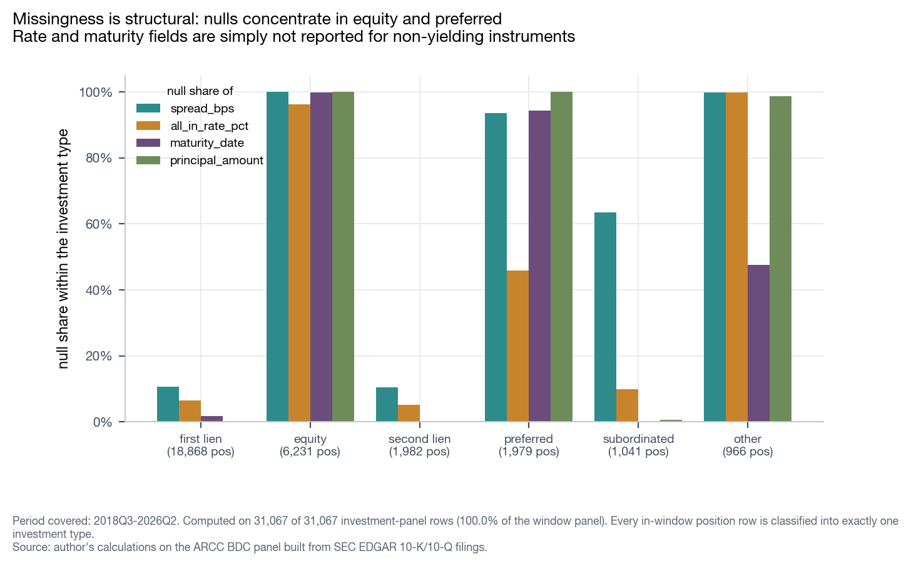

*Period covered: 2018Q3-2026Q2. Computed on 31,067 of 31,067 investment-panel rows (100.0% of the window panel). Every in-window position row is classified into exactly one investment type.*

*Source: author's calculations on the ARCC BDC panel built from SEC EDGAR 10-K/10-Q filings.*

**Table 3. Null share of rate and term fields by investment type**

*Period covered: 2018Q3-2026Q2. Computed on 31,067 of 31,067 investment-panel rows (100.0% of the window panel). Every in-window position row is classified into exactly one investment type.*

| investment_type   |   positions |   share_of_positions_pct |   share_of_pooled_fair_value_pct |   null_reference_rate_pct |   null_spread_bps_pct |   null_all_in_rate_pct_pct |   null_maturity_date_pct |   null_principal_amount_pct |
|:------------------|------------:|-------------------------:|---------------------------------:|--------------------------:|----------------------:|---------------------------:|-------------------------:|----------------------------:|
| first lien        |       18868 |                    60.73 |                            50.01 |                      6.50 |                 10.70 |                       6.50 |                     1.70 |                        0.00 |
| equity            |        6231 |                    20.06 |                            14.43 |                     96.20 |                100.00 |                      96.20 |                    99.90 |                      100.00 |
| second lien       |        1982 |                     6.38 |                            16.07 |                      5.10 |                 10.40 |                       5.10 |                     0.00 |                        0.10 |
| preferred         |        1979 |                     6.37 |                             7.88 |                     45.90 |                 93.60 |                      45.90 |                    94.30 |                      100.00 |
| subordinated      |        1041 |                     3.35 |                            11.37 |                      9.80 |                 63.40 |                       9.80 |                     0.10 |                        0.70 |
| other             |         966 |                     3.11 |                             0.24 |                     99.80 |                 99.90 |                      99.80 |                    47.50 |                       98.70 |

*Note: Positions are counted equal-weight. share_of_pooled_fair_value_pct is weighted by fair value POOLED over all 30 quarter-ends, so a position held for k quarters enters k times; read it as a share of position-quarter fair value, not as a portfolio weight at any one date. Null shares use each type's own position count as the denominator. Nulls in equity and preferred are structural, not parse failures: those instruments carry no coupon or stated maturity in the Schedule of Investments. The 2018Q3-2026Q2 stamp is not continuous: 30 of the 32 calendar quarters in that span are present; 2019Q3 and 2022Q1 are absent from the panel and contribute no rows here.*

*Source: author's calculations on the ARCC BDC panel built from SEC EDGAR 10-K/10-Q filings.*

The second axis is filing vintage, and it moves the right way. Within debt-like positions the null share of `spread_bps` averages 19.0% before 2021 and 9.5% from 2024 onward, with a 27.9% peak in 2020Q4 and an 8.2% trough in 2025Q2; the non-debt group averages 98.5% null throughout. Because both axes move at once, any comparison of rate statistics across time mixes a genuine change in pricing with a changing composition of which positions disclose a rate. This report documents that mix; it does not correct for it.

**Figure 4. The other axis of missingness: filing vintage**

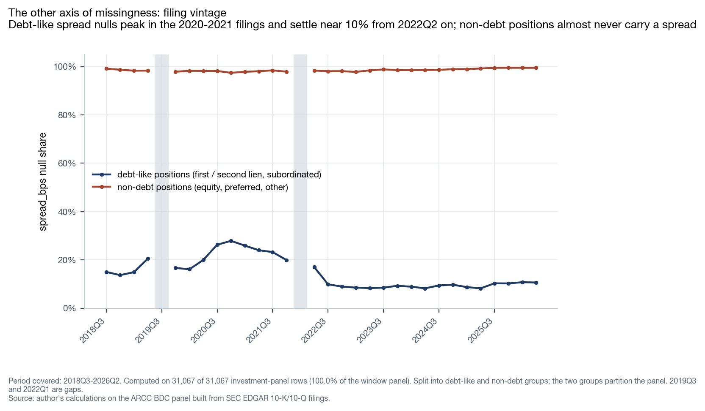

*Period covered: 2018Q3-2026Q2. Computed on 31,067 of 31,067 investment-panel rows (100.0% of the window panel). Split into debt-like and non-debt groups; the two groups partition the panel. 2019Q3 and 2022Q1 are gaps.*

*Source: author's calculations on the ARCC BDC panel built from SEC EDGAR 10-K/10-Q filings.*

Within-quarter completeness improves across the window on every rate and term field: reference rate and all-in rate from 63.4% of positions in 2018Q3 to 72.1% in 2026Q2 (+8.7pp), spread from 59.1% to 64.9% (+5.8pp, with a 51.4% trough in 2021Q2), and maturity date from 67.7% to 74.4% (+6.8pp, trough 62.8% in 2021Q2).

**Figure 5. Completeness of the four rate and term fields, quarter by quarter**

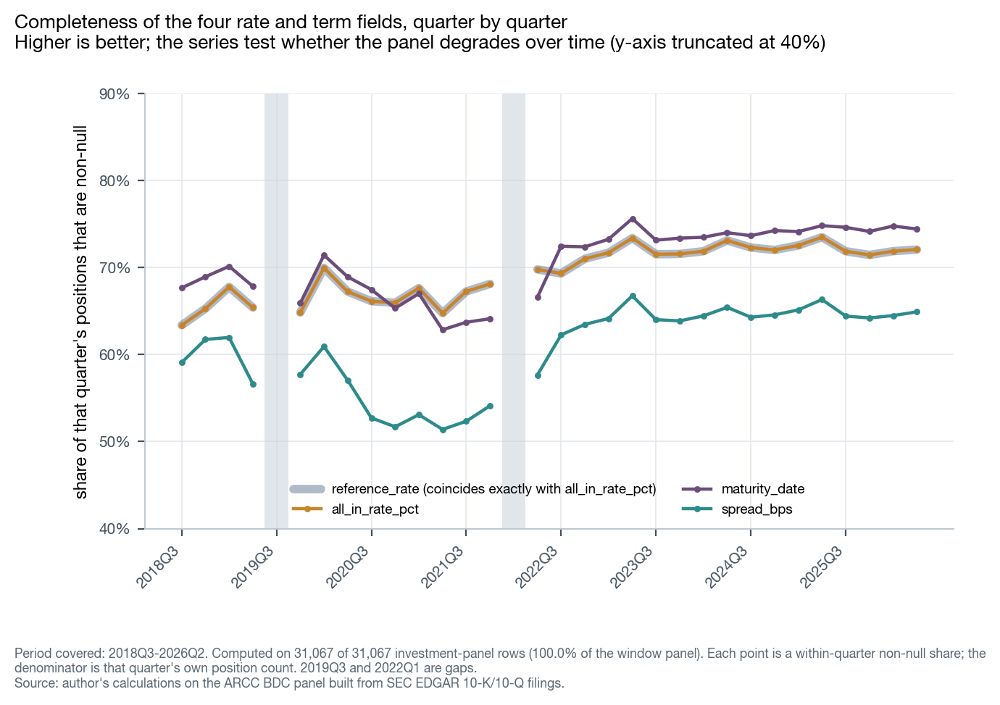

*Period covered: 2018Q3-2026Q2. Computed on 31,067 of 31,067 investment-panel rows (100.0% of the window panel). Each point is a within-quarter non-null share; the denominator is that quarter's own position count. 2019Q3 and 2022Q1 are gaps.*

*Source: author's calculations on the ARCC BDC panel built from SEC EDGAR 10-K/10-Q filings.*

## 2.4 How much of the book the rate exhibits actually describe

Weighted by fair value, the share of the portfolio carrying both a usable spread and a usable all-in rate ranges from 67.6% (2024Q1) to 82.9% (2018Q4). It was 80.6% in 2018Q3 and 71.3% in 2026Q2; the pooled fair-value-weighted figure over the window is 71.7% and the unweighted mean of the 30 quarterly shares is 72.6%. Coverage is worse recently: the unweighted mean from 2023Q1 onward is 69.4%. Usable all-in rate alone averages 84.9% of fair value. Two mechanical points explain the gap between the fair-value line (72.6%) and the equal-weight line (60.7%): larger positions are better documented, and 3,283 of 31,067 rows (10.6%) carry a fair value of exactly $0 and so receive zero weight in every fair-value-weighted series while still counting in the equal-weight one.

**Figure 6. Fair-value-weighted coverage of the rate fields**

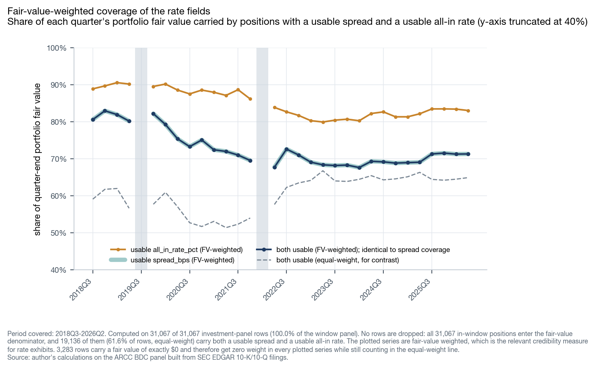

*Period covered: 2018Q3-2026Q2. Computed on 31,067 of 31,067 investment-panel rows (100.0% of the window panel). No rows are dropped: all 31,067 in-window positions enter the fair-value denominator, and 19,136 of them (61.6% of rows, equal-weight) carry both a usable spread and a usable all-in rate. The plotted series are fair-value weighted, which is the relevant credibility measure for rate exhibits. 3,283 rows carry a fair value of exactly $0 and therefore get zero weight in every plotted series while still counting in the equal-weight line.*

*Source: author's calculations on the ARCC BDC panel built from SEC EDGAR 10-K/10-Q filings.*

**Table 4. Fair-value-weighted rate-field coverage by quarter**

*Period covered: 2018Q3-2026Q2. Computed on 31,067 of 31,067 investment-panel rows (100.0% of the window panel). No rows are dropped: all 31,067 in-window positions enter the fair-value denominator, and 19,136 of them (61.6% of rows, equal-weight) carry both a usable spread and a usable all-in rate. The plotted series are fair-value weighted, which is the relevant credibility measure for rate exhibits. 3,283 rows carry a fair value of exactly $0 and therefore get zero weight in every plotted series while still counting in the equal-weight line.*

| quarter   |   fv_share_usable_spread_pct |   fv_share_usable_all_in_rate_pct |   fv_share_both_usable_pct |   equal_weight_share_both_usable_pct |
|:----------|-----------------------------:|----------------------------------:|---------------------------:|-------------------------------------:|
| 2018Q3    |                        80.57 |                             88.86 |                      80.57 |                                59.09 |
| 2018Q4    |                        82.94 |                             89.66 |                      82.94 |                                61.74 |
| 2019Q1    |                        81.93 |                             90.53 |                      81.93 |                                61.97 |
| 2019Q2    |                        80.16 |                             90.16 |                      80.16 |                                56.64 |
| 2019Q4    |                        82.17 |                             89.52 |                      82.17 |                                57.72 |
| 2020Q1    |                        79.24 |                             90.15 |                      79.24 |                                60.93 |
| 2020Q2    |                        75.39 |                             88.54 |                      75.39 |                                57.05 |
| 2020Q3    |                        73.26 |                             87.50 |                      73.26 |                                52.72 |
| 2020Q4    |                        75.06 |                             88.54 |                      75.06 |                                51.70 |
| 2021Q1    |                        72.42 |                             87.93 |                      72.42 |                                53.10 |
| 2021Q2    |                        71.97 |                             87.10 |                      71.97 |                                51.40 |
| 2021Q3    |                        70.99 |                             88.63 |                      70.99 |                                52.34 |
| 2021Q4    |                        69.53 |                             86.14 |                      69.53 |                                54.00 |
| 2022Q2    |                        67.71 |                             83.85 |                      67.71 |                                57.66 |
| 2022Q3    |                        72.60 |                             82.66 |                      72.60 |                                62.26 |
| 2022Q4    |                        71.00 |                             81.69 |                      71.00 |                                63.47 |
| 2023Q1    |                        69.07 |                             80.28 |                      69.07 |                                64.15 |
| 2023Q2    |                        68.36 |                             79.91 |                      68.36 |                                66.75 |
| 2023Q3    |                        68.17 |                             80.42 |                      68.17 |                                64.01 |
| 2023Q4    |                        68.28 |                             80.67 |                      68.28 |                                63.87 |
| 2024Q1    |                        67.62 |                             80.26 |                      67.62 |                                64.44 |
| 2024Q2    |                        69.31 |                             82.21 |                      69.31 |                                65.43 |
| 2024Q3    |                        69.15 |                             82.65 |                      69.15 |                                64.29 |
| 2024Q4    |                        68.83 |                             81.32 |                      68.83 |                                64.57 |
| 2025Q1    |                        68.95 |                             81.32 |                      68.95 |                                65.13 |
| 2025Q2    |                        69.05 |                             82.14 |                      69.05 |                                66.32 |
| 2025Q3    |                        71.29 |                             83.44 |                      71.29 |                                64.43 |
| 2025Q4    |                        71.52 |                             83.45 |                      71.52 |                                64.20 |
| 2026Q1    |                        71.25 |                             83.40 |                      71.25 |                                64.48 |
| 2026Q2    |                        71.29 |                             83.02 |                      71.29 |                                64.91 |

*Note: 'Usable' means non-null and strictly positive. Every position with a usable spread also carries a usable all-in rate (0 of 31,067 rows are an exception), so the spread column and the both-usable column are identical by observation, not by construction. Each row's denominator is that quarter's own total portfolio fair value across all positions; no position is excluded from the denominator. The equal-weight column is shown only for contrast; all report statements use the fair-value-weighted columns. Averaging this table's rows gives an UNWEIGHTED mean across quarters (72.6%); pooling fair value across the whole window instead gives 71.7%. 2019Q3 and 2022Q1 are absent from the panel and are omitted rather than interpolated, so the 30 rows are not an evenly spaced series.*

*Source: author's calculations on the ARCC BDC panel built from SEC EDGAR 10-K/10-Q filings.*

## 2.5 The internal consistency check

The accounting identity total assets minus total liabilities equals net assets holds in all 30 in-window quarters, with a maximum absolute discrepancy of $0.00, or 0.0000 bps of net assets. This confirms that the balance sheet was parsed coherently. It is not an independent audit: the same identity is one of the checks in the build gate that decided which filings entered the panel, so filings that broke it are absent by construction, and it cannot be read as evidence that the Schedule of Investments parser is correct.

**Table 5. Balance-sheet identity check: total assets - total liabilities vs net assets**

*Period covered: 2018Q3-2026Q2. Computed on 30 of 30 quarter-panel rows (100.0% of the window panel). All in-window quarters carry the three balance-sheet fields, so the check runs on every one of them.*

| quarter   |      total_assets |   total_liabilities |        net_assets |   implied_net_assets |   discrepancy_usd |   discrepancy_bps_of_net_assets |
|:----------|------------------:|--------------------:|------------------:|---------------------:|------------------:|--------------------------------:|
| 2018Q3    | 12,255,000,000.00 |    4,942,000,000.00 |  7,313,000,000.00 |     7,313,000,000.00 |              0.00 |                            0.00 |
| 2018Q4    | 12,895,000,000.00 |    5,595,000,000.00 |  7,300,000,000.00 |     7,300,000,000.00 |              0.00 |                            0.00 |
| 2019Q1    | 13,962,000,000.00 |    6,623,000,000.00 |  7,339,000,000.00 |     7,339,000,000.00 |              0.00 |                            0.00 |
| 2019Q2    | 13,846,000,000.00 |    6,478,000,000.00 |  7,368,000,000.00 |     7,368,000,000.00 |              0.00 |                            0.00 |
| 2019Q4    | 14,905,000,000.00 |    7,438,000,000.00 |  7,467,000,000.00 |     7,467,000,000.00 |              0.00 |                            0.00 |
| 2020Q1    | 15,806,000,000.00 |    9,223,000,000.00 |  6,583,000,000.00 |     6,583,000,000.00 |              0.00 |                            0.00 |
| 2020Q2    | 14,517,000,000.00 |    7,826,000,000.00 |  6,691,000,000.00 |     6,691,000,000.00 |              0.00 |                            0.00 |
| 2020Q3    | 14,950,000,000.00 |    7,987,000,000.00 |  6,963,000,000.00 |     6,963,000,000.00 |              0.00 |                            0.00 |
| 2020Q4    | 16,196,000,000.00 |    9,020,000,000.00 |  7,176,000,000.00 |     7,176,000,000.00 |              0.00 |                            0.00 |
| 2021Q1    | 16,021,000,000.00 |    8,389,000,000.00 |  7,632,000,000.00 |     7,632,000,000.00 |              0.00 |                            0.00 |
| 2021Q2    | 18,026,000,000.00 |    9,948,000,000.00 |  8,078,000,000.00 |     8,078,000,000.00 |              0.00 |                            0.00 |
| 2021Q3    | 19,154,000,000.00 |   10,617,000,000.00 |  8,537,000,000.00 |     8,537,000,000.00 |              0.00 |                            0.00 |
| 2021Q4    | 20,843,000,000.00 |   11,975,000,000.00 |  8,868,000,000.00 |     8,868,000,000.00 |              0.00 |                            0.00 |
| 2022Q2    | 21,797,000,000.00 |   12,462,000,000.00 |  9,335,000,000.00 |     9,335,000,000.00 |              0.00 |                            0.00 |
| 2022Q3    | 22,038,000,000.00 |   12,602,000,000.00 |  9,436,000,000.00 |     9,436,000,000.00 |              0.00 |                            0.00 |
| 2022Q4    | 22,398,000,000.00 |   12,843,000,000.00 |  9,555,000,000.00 |     9,555,000,000.00 |              0.00 |                            0.00 |
| 2023Q1    | 21,812,000,000.00 |   11,763,000,000.00 | 10,049,000,000.00 |    10,049,000,000.00 |              0.00 |                            0.00 |
| 2023Q2    | 22,231,000,000.00 |   11,877,000,000.00 | 10,354,000,000.00 |    10,354,000,000.00 |              0.00 |                            0.00 |
| 2023Q3    | 22,920,000,000.00 |   12,105,000,000.00 | 10,815,000,000.00 |    10,815,000,000.00 |              0.00 |                            0.00 |
| 2023Q4    | 23,800,000,000.00 |   12,599,000,000.00 | 11,201,000,000.00 |    11,201,000,000.00 |              0.00 |                            0.00 |
| 2024Q1    | 24,256,000,000.00 |   12,384,000,000.00 | 11,872,000,000.00 |    11,872,000,000.00 |              0.00 |                            0.00 |
| 2024Q2    | 26,092,000,000.00 |   13,728,000,000.00 | 12,364,000,000.00 |    12,364,000,000.00 |              0.00 |                            0.00 |
| 2024Q3    | 27,100,000,000.00 |   14,327,000,000.00 | 12,773,000,000.00 |    12,773,000,000.00 |              0.00 |                            0.00 |
| 2024Q4    | 28,254,000,000.00 |   14,899,000,000.00 | 13,355,000,000.00 |    13,355,000,000.00 |              0.00 |                            0.00 |
| 2025Q1    | 28,317,000,000.00 |   14,645,000,000.00 | 13,672,000,000.00 |    13,672,000,000.00 |              0.00 |                            0.00 |
| 2025Q2    | 29,071,000,000.00 |   15,037,000,000.00 | 14,034,000,000.00 |    14,034,000,000.00 |              0.00 |                            0.00 |
| 2025Q3    | 30,806,000,000.00 |   16,484,000,000.00 | 14,322,000,000.00 |    14,322,000,000.00 |              0.00 |                            0.00 |
| 2025Q4    | 31,235,000,000.00 |   16,917,000,000.00 | 14,318,000,000.00 |    14,318,000,000.00 |              0.00 |                            0.00 |
| 2026Q1    | 30,679,000,000.00 |   16,614,000,000.00 | 14,065,000,000.00 |    14,065,000,000.00 |              0.00 |                            0.00 |
| 2026Q2    | 30,498,000,000.00 |   16,607,000,000.00 | 13,891,000,000.00 |    13,891,000,000.00 |              0.00 |                            0.00 |

*Note: The identity total_assets - total_liabilities = net_assets ties in all 30 in-window quarters; the largest absolute discrepancy is $0.00 (0.0000 bps of net assets, in 2018Q3). Read this as a parse-integrity confirmation rather than an independent audit: total_assets, total_liabilities and net_assets are each parsed separately from the filing, but the same identity is one of the 16 gate checks the build applies (tolerance max(0.05% of total assets, $1)), so any filing that broke it was excluded from the panel. 2019Q3 and 2022Q1 failed the gate and are absent; which check each of them failed is not established here.*

*Source: author's calculations on the ARCC BDC panel built from SEC EDGAR 10-K/10-Q filings.*

---

# 3. Summary statistics

**Finding.** Over 7.75 years the book grew 161.6% at fair value to $29.349bn while net assets grew 89.9%, so growth was financed disproportionately with debt; per-share book value barely moved, rising 12.7% from $17.17 to $19.35, and the portfolio became broader (313 to 593 borrowers) and less concentrated (top-25 share 45.8% to 34.1%) as it grew.

## 3.1 Scale

**Table 6. Portfolio scale at three snapshots**

*Period covered: 2018Q3-2026Q2. Computed on 3 of 30 quarter-panel rows (10.0% of the window panel). Three snapshot quarters out of the 30 in-window quarters. Position and borrower counts come from the 31,067-row investment panel restricted to those same three quarters. NAV per share is derived as net_assets / shares_outstanding because the filed nav_per_share field is 90% null in this panel.*

| metric                        |   2018Q3 |   2022Q3 |   2026Q2 |   pct_change_2018Q3_to_2026Q2 |
|:------------------------------|---------:|---------:|---------:|------------------------------:|
| total_investments_fv_usd_bn   |    11.22 |    21.34 |    29.35 |                        161.58 |
| total_assets_usd_bn           |    12.26 |    22.04 |    30.50 |                        148.86 |
| net_assets_usd_bn             |     7.31 |     9.44 |    13.89 |                         89.95 |
| total_debt_outstanding_usd_bn |     4.55 |    11.82 |    15.77 |                        246.96 |
| shares_outstanding_mm         |   426.00 |   508.00 |   718.00 |                         68.54 |
| nav_per_share_derived_usd     |    17.17 |    18.57 |    19.35 |                         12.70 |
| position_count                |   770.00 |   991.00 | 1,439.00 |                         86.88 |
| distinct_borrowers            |   313.00 |   427.00 |   593.00 |                         89.46 |

*Note: NAV per share is derived as net_assets / shares_outstanding. Percentage change is 2018Q3 to 2026Q2, the first and last in-window quarters.*

*Source: author's calculations on the ARCC BDC panel built from SEC EDGAR 10-K/10-Q filings.*

**Figure 7. Balance-sheet scale, ARCC**

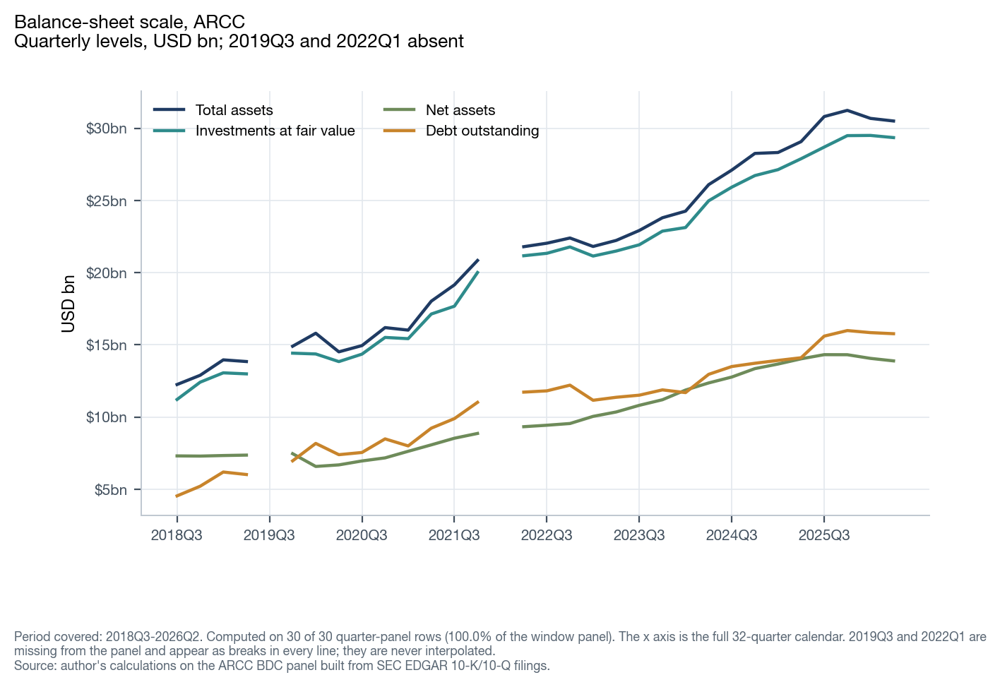

*Period covered: 2018Q3-2026Q2. Computed on 30 of 30 quarter-panel rows (100.0% of the window panel). The x axis is the full 32-quarter calendar. 2019Q3 and 2022Q1 are missing from the panel and appear as breaks in every line; they are never interpolated.*

*Source: author's calculations on the ARCC BDC panel built from SEC EDGAR 10-K/10-Q filings.*

NAV per share is derived throughout this report as net assets divided by shares outstanding, because the filed `nav_per_share` field is populated in only 3 of the 30 quarter rows. On that derivation NAV per share was $17.17 in 2018Q3, troughed at $15.56 in 2020Q1, peaked at $20.00 in 2025Q3 and stood at $19.35 in 2026Q2. Shares outstanding rose 68.5% over the same span, so most of the growth in net assets is issuance rather than accumulation of value per share.

**Figure 8. NAV per share, derived**

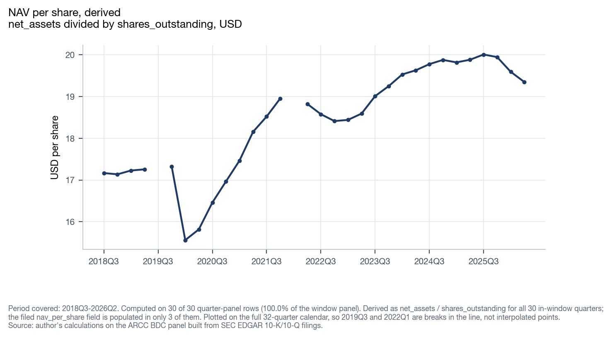

*Period covered: 2018Q3-2026Q2. Computed on 30 of 30 quarter-panel rows (100.0% of the window panel). Derived as net_assets / shares_outstanding for all 30 in-window quarters; the filed nav_per_share field is populated in only 3 of them. Plotted on the full 32-quarter calendar, so 2019Q3 and 2022Q1 are breaks in the line, not interpolated points.*

*Source: author's calculations on the ARCC BDC panel built from SEC EDGAR 10-K/10-Q filings.*

## 3.2 Position size and concentration

Position size is heavily right-skewed. Pooled across the window the median position is $5.30mm at fair value against a $19.86mm mean, with p99 at $171.07mm and a $1,932.70mm maximum; in 2026Q2 the median is $5.70mm across 1,439 positions with a $1,896.80mm maximum. These are equal-weighted distributional statistics; the concentration measures that follow are fair-value weighted, and the two are not comparable.

**Table 7. Position size at fair value: distribution**

*Period covered: 2018Q3-2026Q2. Computed on 31,067 of 31,067 investment-panel rows (100.0% of the window panel). Position size is fair_value, which is 0% null, so the pooled row uses every in-window position. The latest-quarter row uses the 1,439 positions dated 2026Q2. These are equal-weight distributional statistics of position size; the concentration exhibits below are fair-value-weighted.*

| sample                |     n |   mean_usd_mm |   p10_usd_mm |   p25_usd_mm |   median_usd_mm |   p75_usd_mm |   p90_usd_mm |   p99_usd_mm |   max_usd_mm |
|:----------------------|------:|--------------:|-------------:|-------------:|----------------:|-------------:|-------------:|-------------:|-------------:|
| Pooled 2018Q3-2026Q2  | 31067 |         19.86 |         0.00 |         0.90 |            5.30 |        19.60 |        50.60 |       171.07 |     1,932.70 |
| Latest quarter 2026Q2 |  1439 |         20.40 |         0.10 |         1.30 |            5.70 |        17.50 |        46.74 |       191.23 |     1,896.80 |

*Note: Equal-weight across positions. Denominator for the pooled row is all 31,067 in-window positions; for the latest row, the 1,439 positions in 2026Q2.*

*Source: author's calculations on the ARCC BDC panel built from SEC EDGAR 10-K/10-Q filings.*

Concentration fell as the book grew. The top-25 borrower share of fair value went from 45.8% in 2018Q3 to 34.1% in 2026Q2, and the top-10 share from 25.6% to 22.4% within a window range of 18.5% to 27.0%. The largest borrower in 2026Q2 is Ivy Hill Asset Management, L.P at 9.7% of fair value, which is an affiliated asset manager rather than a portfolio company.

**Figure 9. Borrower concentration**

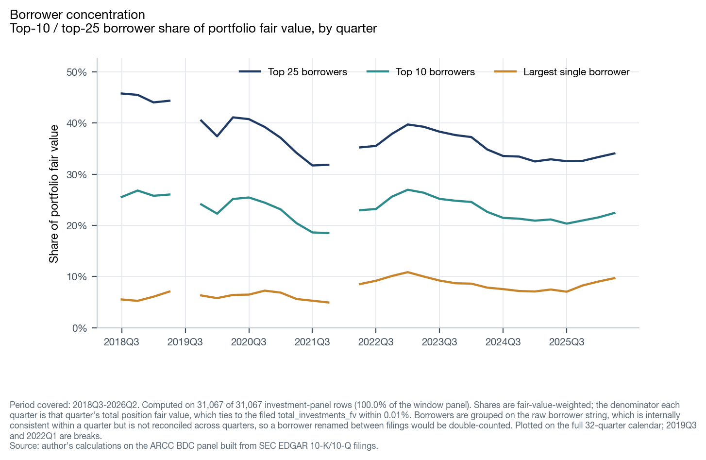

*Period covered: 2018Q3-2026Q2. Computed on 31,067 of 31,067 investment-panel rows (100.0% of the window panel). Shares are fair-value-weighted; the denominator each quarter is that quarter's total position fair value, which ties to the filed total_investments_fv within 0.01%. Borrowers are grouped on the raw borrower string, which is internally consistent within a quarter but is not reconciled across quarters, so a borrower renamed between filings would be double-counted. Plotted on the full 32-quarter calendar; 2019Q3 and 2022Q1 are breaks.*

*Source: author's calculations on the ARCC BDC panel built from SEC EDGAR 10-K/10-Q filings.*

**Table 8. Borrower concentration by quarter**

*Period covered: 2018Q3-2026Q2. Computed on 31,067 of 31,067 investment-panel rows (100.0% of the window panel). Shares are fair-value-weighted; the denominator each quarter is that quarter's total position fair value, which ties to the filed total_investments_fv within 0.01%. Borrowers are grouped on the raw borrower string, which is internally consistent within a quarter but is not reconciled across quarters, so a borrower renamed between filings would be double-counted. Plotted on the full 32-quarter calendar; 2019Q3 and 2022Q1 are breaks.*

| quarter   |   borrowers |   portfolio_fv_usd_bn |   top10_share_pct |   top25_share_pct |   largest_borrower_share_pct | largest_borrower                   |
|:----------|------------:|----------------------:|------------------:|------------------:|-----------------------------:|:-----------------------------------|
| 2018Q3    |         313 |                 11.22 |             25.55 |             45.78 |                         5.52 | Senior Direct Lending Program, LLC |
| 2018Q4    |         318 |                 12.42 |             26.81 |             45.51 |                         5.25 | Senior Direct Lending Program, LLC |
| 2019Q1    |         318 |                 13.06 |             25.79 |             44.04 |                         6.06 | Senior Direct Lending Program, LLC |
| 2019Q2    |         326 |                 12.99 |             26.03 |             44.36 |                         7.06 | Senior Direct Lending Program, LLC |
| 2019Q4    |         337 |                 14.43 |             24.11 |             40.49 |                         6.30 | Senior Direct Lending Program, LLC |
| 2020Q1    |         349 |                 14.37 |             22.29 |             37.42 |                         5.78 | Senior Direct Lending Program, LLC |
| 2020Q2    |         341 |                 13.84 |             25.16 |             41.12 |                         6.40 | Senior Direct Lending Program, LLC |
| 2020Q3    |         329 |                 14.36 |             25.45 |             40.77 |                         6.47 | Senior Direct Lending Program, LLC |
| 2020Q4    |         330 |                 15.52 |             24.44 |             39.24 |                         7.24 | Senior Direct Lending Program, LLC |
| 2021Q1    |         335 |                 15.43 |             23.12 |             37.11 |                         6.86 | Senior Direct Lending Program, LLC |
| 2021Q2    |         352 |                 17.14 |             20.43 |             34.17 |                         5.61 | Senior Direct Lending Program, LLC |
| 2021Q3    |         349 |                 17.68 |             18.62 |             31.71 |                         5.27 | Senior Direct Lending Program, LLC |
| 2021Q4    |         366 |                 20.01 |             18.49 |             31.84 |                         4.93 | Senior Direct Lending Program, LLC |
| 2022Q2    |         418 |                 21.17 |             22.96 |             35.25 |                         8.53 | Ivy Hill Asset Management, L.P     |
| 2022Q3    |         427 |                 21.34 |             23.21 |             35.53 |                         9.18 | Ivy Hill Asset Management, L.P     |
| 2022Q4    |         436 |                 21.78 |             25.61 |             37.88 |                        10.11 | Ivy Hill Asset Management, L.P     |
| 2023Q1    |         434 |                 21.15 |             26.97 |             39.73 |                        10.85 | Ivy Hill Asset Management, L.P     |
| 2023Q2    |         448 |                 21.50 |             26.39 |             39.28 |                        10.01 | Ivy Hill Asset Management, L.P     |
| 2023Q3    |         462 |                 21.93 |             25.18 |             38.31 |                         9.21 | Ivy Hill Asset Management, L.P     |
| 2023Q4    |         478 |                 22.87 |             24.82 |             37.65 |                         8.69 | Ivy Hill Asset Management, L.P     |
| 2024Q1    |         484 |                 23.12 |             24.58 |             37.26 |                         8.61 | Ivy Hill Asset Management, L.P     |
| 2024Q2    |         501 |                 24.97 |             22.64 |             34.84 |                         7.83 | Ivy Hill Asset Management, L.P     |
| 2024Q3    |         516 |                 25.92 |             21.47 |             33.56 |                         7.54 | Ivy Hill Asset Management, L.P     |
| 2024Q4    |         530 |                 26.72 |             21.31 |             33.45 |                         7.17 | Ivy Hill Asset Management, L.P     |
| 2025Q1    |         544 |                 27.13 |             20.92 |             32.50 |                         7.08 | Ivy Hill Asset Management, L.P     |
| 2025Q2    |         542 |                 27.89 |             21.16 |             32.92 |                         7.46 | Ivy Hill Asset Management, L.P     |
| 2025Q3    |         560 |                 28.69 |             20.34 |             32.54 |                         7.03 | Ivy Hill Asset Management, L.P     |
| 2025Q4    |         580 |                 29.48 |             20.96 |             32.61 |                         8.25 | Ivy Hill Asset Management, L.P     |
| 2026Q1    |         583 |                 29.50 |             21.56 |             33.36 |                         9.02 | Ivy Hill Asset Management, L.P     |
| 2026Q2    |         593 |                 29.35 |             22.43 |             34.06 |                         9.69 | Ivy Hill Asset Management, L.P     |

*Note: Fair-value-weighted. Denominator is each quarter's total position fair value.*

*Source: author's calculations on the ARCC BDC panel built from SEC EDGAR 10-K/10-Q filings.*

## 3.3 Marks

The aggregate mark, fair value over cost across all in-window positions, ran from a 92.8% trough in 2020Q1 to a 101.4% peak in 2024Q1 and was 98.9% in 2026Q2; 14 of the 30 quarters print above 100%. Because it is a portfolio ratio it is dominated by the largest positions and is not the median borrower's mark.

**Figure 10. Aggregate mark: fair value over cost**

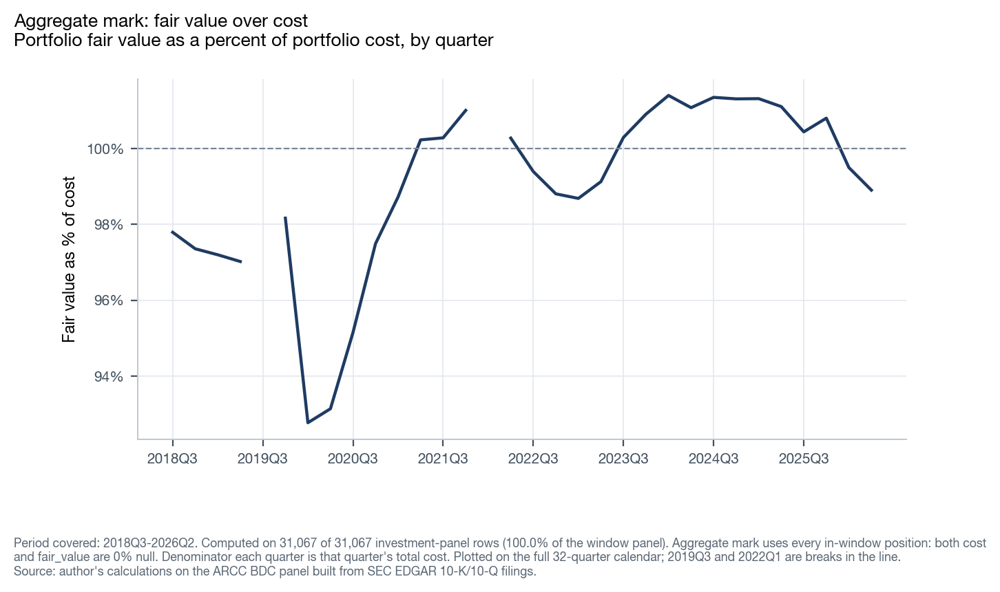

*Period covered: 2018Q3-2026Q2. Computed on 31,067 of 31,067 investment-panel rows (100.0% of the window panel). Aggregate mark uses every in-window position: both cost and fair_value are 0% null. Denominator each quarter is that quarter's total cost. Plotted on the full 32-quarter calendar; 2019Q3 and 2022Q1 are breaks in the line.*

*Source: author's calculations on the ARCC BDC panel built from SEC EDGAR 10-K/10-Q filings.*

The tail of marked-down positions is wider by count than by value. Positions carried below 90% of cost peaked at 16.0% of fair value and 23.6% of positions in 2020Q2; in 2026Q2 they were 8.2% of fair value and 14.8% of positions, and the below-70% band was 2.7% of fair value and 7.5% of positions. Two exclusions shape that gap: 2,635 positions with a zero cost basis (unfunded commitments and undrawn revolvers) are excluded because the ratio is undefined, and 989 of the included positions are marked at exactly zero fair value and therefore land in the deepest band by construction. The position-count tail is not a count of credit impairments.

**Figure 11. Markdown tails: positions carried below cost**

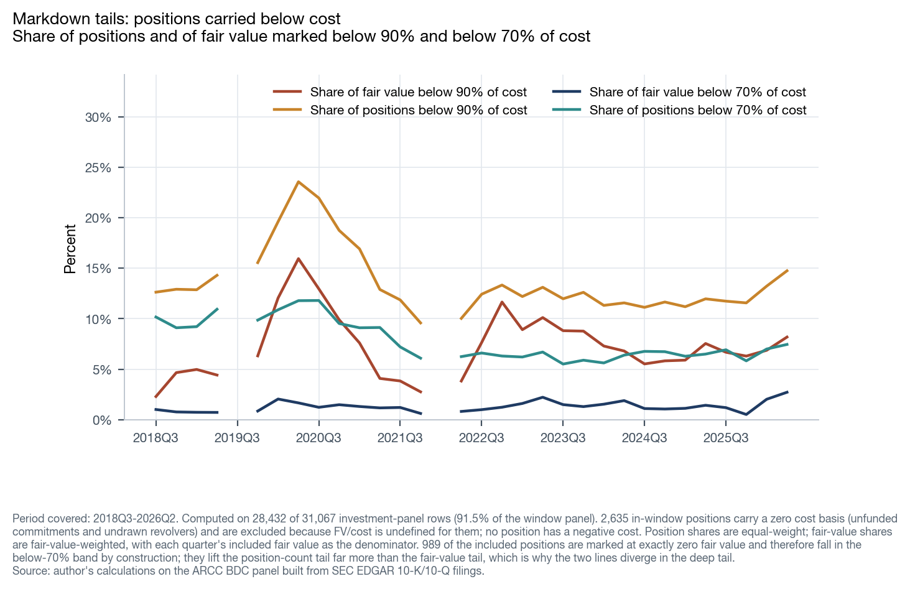

*Period covered: 2018Q3-2026Q2. Computed on 28,432 of 31,067 investment-panel rows (91.5% of the window panel). 2,635 in-window positions carry a zero cost basis (unfunded commitments and undrawn revolvers) and are excluded because FV/cost is undefined for them; no position has a negative cost. Position shares are equal-weight; fair-value shares are fair-value-weighted, with each quarter's included fair value as the denominator. 989 of the included positions are marked at exactly zero fair value and therefore fall in the below-70% band by construction; they lift the position-count tail far more than the fair-value tail, which is why the two lines diverge in the deep tail.*

*Source: author's calculations on the ARCC BDC panel built from SEC EDGAR 10-K/10-Q filings.*

**Table 9. Cost versus fair value by quarter**

*Period covered: 2018Q3-2026Q2. Computed on 28,432 of 31,067 investment-panel rows (91.5% of the window panel). 2,635 in-window positions carry a zero cost basis (unfunded commitments and undrawn revolvers) and are excluded because FV/cost is undefined for them; no position has a negative cost. Position shares are equal-weight; fair-value shares are fair-value-weighted, with each quarter's included fair value as the denominator. 989 of the included positions are marked at exactly zero fair value and therefore fall in the below-70% band by construction; they lift the position-count tail far more than the fair-value tail, which is why the two lines diverge in the deep tail.*

| quarter   |   positions_with_cost_gt0 |   share_positions_below_90pct_of_cost |   share_fv_below_90pct_of_cost |   share_positions_below_70pct_of_cost |   share_fv_below_70pct_of_cost |   median_fv_over_cost_pct |   fv_over_cost_pct |
|:----------|--------------------------:|--------------------------------------:|-------------------------------:|--------------------------------------:|-------------------------------:|--------------------------:|-------------------:|
| 2018Q3    |                       649 |                                 12.63 |                           2.29 |                                 10.17 |                           1.00 |                    100.00 |              97.79 |
| 2018Q4    |                       681 |                                 12.92 |                           4.65 |                                  9.10 |                           0.76 |                    100.00 |              97.36 |
| 2019Q1    |                       738 |                                 12.87 |                           4.97 |                                  9.21 |                           0.72 |                    100.00 |              97.20 |
| 2019Q2    |                       713 |                                 14.31 |                           4.41 |                                 10.94 |                           0.71 |                    100.00 |              97.02 |
| 2019Q4    |                       649 |                                 15.56 |                           6.32 |                                  9.86 |                           0.84 |                    100.00 |              98.16 |
| 2020Q1    |                       744 |                                 19.62 |                          12.06 |                                 10.89 |                           2.04 |                     96.68 |              92.77 |
| 2020Q2    |                       687 |                                 23.58 |                          15.96 |                                 11.79 |                           1.65 |                     96.94 |              93.14 |
| 2020Q3    |                       669 |                                 21.97 |                          12.97 |                                 11.81 |                           1.22 |                    100.00 |              95.15 |
| 2020Q4    |                       693 |                                 18.76 |                           9.90 |                                  9.52 |                           1.47 |                    100.00 |              97.49 |
| 2021Q1    |                       703 |                                 16.93 |                           7.60 |                                  9.10 |                           1.30 |                    100.00 |              98.72 |
| 2021Q2    |                       690 |                                 12.90 |                           4.08 |                                  9.13 |                           1.16 |                    100.00 |             100.23 |
| 2021Q3    |                       708 |                                 11.86 |                           3.83 |                                  7.20 |                           1.20 |                    100.00 |             100.28 |
| 2021Q4    |                       772 |                                  9.59 |                           2.75 |                                  6.09 |                           0.61 |                    100.00 |             101.01 |
| 2022Q2    |                       897 |                                 10.03 |                           3.82 |                                  6.24 |                           0.81 |                    100.00 |             100.28 |
| 2022Q3    |                       909 |                                 12.43 |                           7.64 |                                  6.60 |                           0.98 |                    100.00 |              99.39 |
| 2022Q4    |                       952 |                                 13.34 |                          11.65 |                                  6.30 |                           1.22 |                    100.00 |              98.81 |
| 2023Q1    |                       967 |                                 12.20 |                           8.92 |                                  6.20 |                           1.60 |                    100.00 |              98.69 |
| 2023Q2    |                      1090 |                                 13.12 |                          10.11 |                                  6.70 |                           2.21 |                    100.00 |              99.13 |
| 2023Q3    |                      1035 |                                 11.98 |                           8.81 |                                  5.51 |                           1.48 |                    100.00 |             100.30 |
| 2023Q4    |                      1070 |                                 12.62 |                           8.77 |                                  5.89 |                           1.29 |                    100.00 |             100.91 |
| 2024Q1    |                      1104 |                                 11.32 |                           7.29 |                                  5.62 |                           1.53 |                    100.00 |             101.40 |
| 2024Q2    |                      1158 |                                 11.57 |                           6.80 |                                  6.39 |                           1.88 |                    100.00 |             101.08 |
| 2024Q3    |                      1168 |                                 11.13 |                           5.52 |                                  6.76 |                           1.09 |                    100.00 |             101.35 |
| 2024Q4    |                      1218 |                                 11.66 |                           5.82 |                                  6.73 |                           1.05 |                    100.00 |             101.31 |
| 2025Q1    |                      1242 |                                 11.19 |                           5.89 |                                  6.28 |                           1.11 |                    100.00 |             101.32 |
| 2025Q2    |                      1278 |                                 11.97 |                           7.54 |                                  6.49 |                           1.42 |                    100.00 |             101.11 |
| 2025Q3    |                      1286 |                                 11.74 |                           6.67 |                                  6.92 |                           1.18 |                    100.00 |             100.44 |
| 2025Q4    |                      1305 |                                 11.57 |                           6.30 |                                  5.82 |                           0.51 |                    100.00 |             100.80 |
| 2026Q1    |                      1315 |                                 13.23 |                           6.87 |                                  7.00 |                           2.01 |                    100.00 |              99.50 |
| 2026Q2    |                      1342 |                                 14.75 |                           8.18 |                                  7.45 |                           2.71 |                    100.00 |              98.90 |

*Note: fv_over_cost_pct uses all positions; the below-90 and below-70 columns use only positions with a positive cost basis.*

*Source: author's calculations on the ARCC BDC panel built from SEC EDGAR 10-K/10-Q filings.*

## 3.4 Non-accruals

Pooled over the 27 quarters with a usable flag, 562 of 27,588 positions were on non-accrual, 2.04%. The 31,067-row denominator that would give 1.81% is the wrong one, because the three parse-gap quarters contribute rows but no flags. The series peaked at 5.06% of cost and 3.18% of fair value in 2020Q3. In 2026Q2 non-accruals were 2.38% of cost and 1.38% of fair value: $707.6mm of cost carried at $404.4mm of fair value, a 57.2% mark.

**Figure 12. Non-accrual positions**

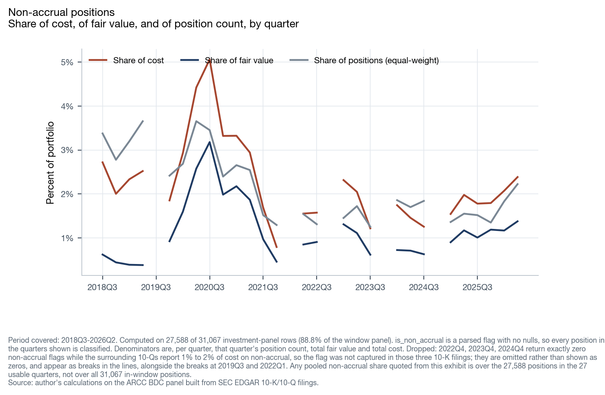

*Period covered: 2018Q3-2026Q2. Computed on 27,588 of 31,067 investment-panel rows (88.8% of the window panel). is_non_accrual is a parsed flag with no nulls, so every position in the quarters shown is classified. Denominators are, per quarter, that quarter's position count, total fair value and total cost. Dropped: 2022Q4, 2023Q4, 2024Q4 return exactly zero non-accrual flags while the surrounding 10-Qs report 1% to 2% of cost on non-accrual, so the flag was not captured in those three 10-K filings; they are omitted rather than shown as zeros, and appear as breaks in the lines, alongside the breaks at 2019Q3 and 2022Q1. Any pooled non-accrual share quoted from this exhibit is over the 27,588 positions in the 27 usable quarters, not over all 31,067 in-window positions.*

*Source: author's calculations on the ARCC BDC panel built from SEC EDGAR 10-K/10-Q filings.*

**Table 10. Non-accruals by quarter**

*Period covered: 2018Q3-2026Q2. Computed on 27,588 of 31,067 investment-panel rows (88.8% of the window panel). is_non_accrual is a parsed flag with no nulls, so every position in the quarters shown is classified. Denominators are, per quarter, that quarter's position count, total fair value and total cost. Dropped: 2022Q4, 2023Q4, 2024Q4 return exactly zero non-accrual flags while the surrounding 10-Qs report 1% to 2% of cost on non-accrual, so the flag was not captured in those three 10-K filings; they are omitted rather than shown as zeros, and appear as breaks in the lines, alongside the breaks at 2019Q3 and 2022Q1. Any pooled non-accrual share quoted from this exhibit is over the 27,588 positions in the 27 usable quarters, not over all 31,067 in-window positions.*

| quarter   |   positions |   non_accrual_positions |   non_accrual_share_of_positions_pct |   non_accrual_share_of_fv_pct |   non_accrual_share_of_cost_pct |   non_accrual_fv_usd_mm |   non_accrual_cost_usd_mm |
|:----------|------------:|------------------------:|-------------------------------------:|------------------------------:|--------------------------------:|------------------------:|--------------------------:|
| 2018Q3    |         770 |                      26 |                                 3.38 |                          0.62 |                            2.72 |                   69.70 |                    312.00 |
| 2018Q4    |         792 |                      22 |                                 2.78 |                          0.44 |                            2.00 |                   55.00 |                    255.50 |
| 2019Q1    |         844 |                      27 |                                 3.20 |                          0.39 |                            2.33 |                   50.80 |                    313.70 |
| 2019Q2    |         821 |                      30 |                                 3.65 |                          0.38 |                            2.52 |                   49.60 |                    337.50 |
| 2019Q4    |         745 |                      18 |                                 2.42 |                          0.92 |                            1.85 |                  133.40 |                    272.30 |
| 2020Q1    |         819 |                      22 |                                 2.69 |                          1.60 |                            2.93 |                  229.40 |                    453.90 |
| 2020Q2    |         766 |                      28 |                                 3.66 |                          2.58 |                            4.42 |                  356.60 |                    657.20 |
| 2020Q3    |         753 |                      26 |                                 3.45 |                          3.18 |                            5.06 |                  456.60 |                    763.70 |
| 2020Q4    |         793 |                      19 |                                 2.40 |                          1.98 |                            3.32 |                  307.90 |                    528.40 |
| 2021Q1    |         791 |                      21 |                                 2.65 |                          2.18 |                            3.32 |                  335.60 |                    519.50 |
| 2021Q2    |         786 |                      20 |                                 2.54 |                          1.87 |                            2.94 |                  320.10 |                    503.30 |
| 2021Q3    |         791 |                      12 |                                 1.52 |                          0.97 |                            1.69 |                  171.00 |                    297.20 |
| 2021Q4    |         850 |                      11 |                                 1.29 |                          0.46 |                            0.79 |                   91.90 |                    157.10 |
| 2022Q2    |         973 |                      15 |                                 1.54 |                          0.85 |                            1.55 |                  179.90 |                    328.00 |
| 2022Q3    |         991 |                      13 |                                 1.31 |                          0.91 |                            1.57 |                  193.50 |                    338.00 |
| 2023Q1    |        1032 |                      15 |                                 1.45 |                          1.31 |                            2.32 |                  276.90 |                    496.20 |
| 2023Q2    |        1161 |                      20 |                                 1.72 |                          1.11 |                            2.05 |                  238.70 |                    444.00 |
| 2023Q3    |        1117 |                      14 |                                 1.25 |                          0.62 |                            1.22 |                  135.60 |                    266.20 |
| 2024Q1    |        1184 |                      22 |                                 1.86 |                          0.72 |                            1.74 |                  167.40 |                    397.60 |
| 2024Q2    |        1235 |                      21 |                                 1.70 |                          0.71 |                            1.46 |                  177.40 |                    359.90 |
| 2024Q3    |        1249 |                      23 |                                 1.84 |                          0.63 |                            1.25 |                  163.00 |                    320.90 |
| 2025Q1    |        1322 |                      18 |                                 1.36 |                          0.90 |                            1.54 |                  244.60 |                    413.60 |
| 2025Q2    |        1354 |                      21 |                                 1.55 |                          1.17 |                            1.98 |                  326.70 |                    545.70 |
| 2025Q3    |        1383 |                      21 |                                 1.52 |                          1.01 |                            1.78 |                  289.20 |                    508.50 |
| 2025Q4    |        1408 |                      19 |                                 1.35 |                          1.19 |                            1.79 |                  350.30 |                    524.50 |
| 2026Q1    |        1419 |                      26 |                                 1.83 |                          1.17 |                            2.07 |                  344.50 |                    614.50 |
| 2026Q2    |        1439 |                      32 |                                 2.22 |                          1.38 |                            2.38 |                  404.40 |                    707.60 |

*Note: Non-accrual at cost exceeds non-accrual at fair value in every quarter where any exists, because the same positions are already written down. The gap is the informative quantity.*

*Source: author's calculations on the ARCC BDC panel built from SEC EDGAR 10-K/10-Q filings.*

## 3.5 Effective yield

Pooled across the window, the fair-value-weighted all-in rate on rate-bearing positions is 10.02% against an equal-weighted 9.61%, computed on 21,776 positions, 70.1% of rows and 84.1% of in-window fair value. The quarterly series troughed at 8.05% in 2021Q4, peaked at 12.07% in 2023Q3 and was 9.63% in 2026Q2 on 83.0% fair-value coverage. By year: 9.57% (2019), 8.13% (2021), 11.93% (2023) and 9.61% for the partial 2026. Positions with no parsed rate are dropped from both the numerator and the weights, never treated as a zero rate.

**Figure 13. Effective yield and its coverage**

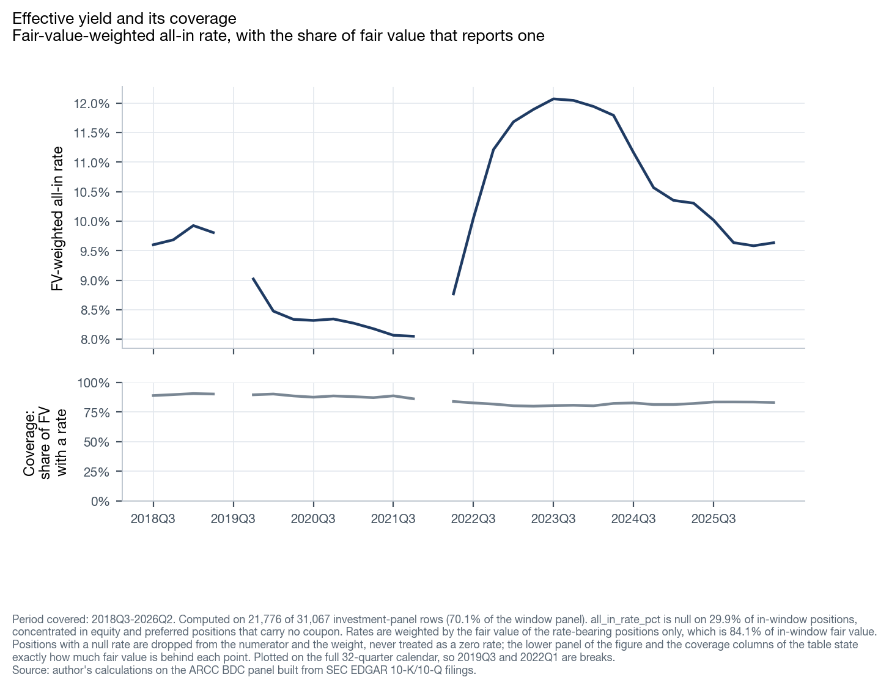

*Period covered: 2018Q3-2026Q2. Computed on 21,776 of 31,067 investment-panel rows (70.1% of the window panel). all_in_rate_pct is null on 29.9% of in-window positions, concentrated in equity and preferred positions that carry no coupon. Rates are weighted by the fair value of the rate-bearing positions only, which is 84.1% of in-window fair value. Positions with a null rate are dropped from the numerator and the weight, never treated as a zero rate; the lower panel of the figure and the coverage columns of the table state exactly how much fair value is behind each point. Plotted on the full 32-quarter calendar, so 2019Q3 and 2022Q1 are breaks.*

*Source: author's calculations on the ARCC BDC panel built from SEC EDGAR 10-K/10-Q filings.*

**Table 11. Effective yield by year**

*Period covered: 2018Q3-2026Q2. Computed on 21,776 of 31,067 investment-panel rows (70.1% of the window panel). all_in_rate_pct is null on 29.9% of in-window positions, concentrated in equity and preferred positions that carry no coupon. Rates are weighted by the fair value of the rate-bearing positions only, which is 84.1% of in-window fair value. Positions with a null rate are dropped from the numerator and the weight, never treated as a zero rate; the lower panel of the figure and the coverage columns of the table state exactly how much fair value is behind each point. Plotted on the full 32-quarter calendar, so 2019Q3 and 2022Q1 are breaks.*

|     year |   positions_with_rate |   positions_total |   rate_coverage_share_of_positions_pct |   rate_coverage_share_of_fv_pct |   fv_weighted_all_in_rate_pct |   equal_weighted_all_in_rate_pct |
|---------:|----------------------:|------------------:|---------------------------------------:|--------------------------------:|------------------------------:|---------------------------------:|
| 2,018.00 |              1,005.00 |          1,562.00 |                                  64.34 |                           89.28 |                          9.64 |                             8.90 |
| 2,019.00 |              1,592.00 |          2,410.00 |                                  66.06 |                           90.05 |                          9.57 |                             8.74 |
| 2,020.00 |              2,109.00 |          3,131.00 |                                  67.36 |                           88.68 |                          8.37 |                             7.71 |
| 2,021.00 |              2,155.00 |          3,218.00 |                                  66.97 |                           87.39 |                          8.13 |                             7.69 |
| 2,022.00 |              2,091.00 |          2,985.00 |                                  70.05 |                           82.72 |                         10.01 |                             9.45 |
| 2,023.00 |              3,219.00 |          4,467.00 |                                  72.06 |                           80.33 |                         11.93 |                            11.43 |
| 2,024.00 |              3,594.00 |          4,969.00 |                                  72.33 |                           81.64 |                         11.34 |                            10.99 |
| 2,025.00 |              3,954.00 |          5,467.00 |                                  72.32 |                           82.61 |                         10.07 |                             9.74 |
| 2,026.00 |              2,057.00 |          2,858.00 |                                  71.97 |                           83.21 |                          9.61 |                             9.22 |

*Note: 2018 and 2026 are partial years (2018Q3-2018Q4 and 2026Q1-2026Q2). The coverage columns give the denominator behind each yield.*

*Source: author's calculations on the ARCC BDC panel built from SEC EDGAR 10-K/10-Q filings.*

---

# 4. Time series

**Finding.** The three structural trends in this book over 7.75 years are a levered expansion (debt to net assets 0.622x to 1.135x, above 1.0x in 24 of 30 observed quarters), a rotation into first lien and out of second lien, and a complete reference-rate migration from LIBOR to SOFR that crossed over in a single quarter, 2023Q2.

## 4.1 Growth

Investments at fair value grew from $11.220bn to $29.349bn, +161.6%, a 13.21% per year compound rate over the 7.75 years from 2018-09-30 to 2026-06-30. Total assets went from $12.255bn to $30.498bn and net assets from $7.313bn to $13.891bn, +89.9% or 8.63% per year. Both growth rates are endpoint-to-endpoint and say nothing about the path between them.

**Figure 14. Balance sheet in levels, quarter by quarter**

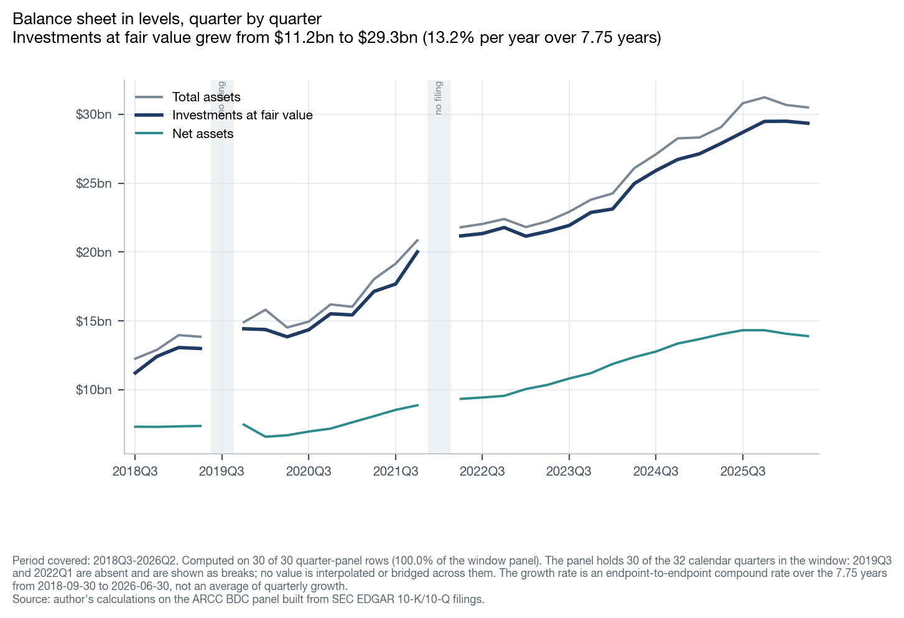

*Period covered: 2018Q3-2026Q2. Computed on 30 of 30 quarter-panel rows (100.0% of the window panel). The panel holds 30 of the 32 calendar quarters in the window: 2019Q3 and 2022Q1 are absent and are shown as breaks; no value is interpolated or bridged across them. The growth rate is an endpoint-to-endpoint compound rate over the 7.75 years from 2018-09-30 to 2026-06-30, not an average of quarterly growth.*

*Source: author's calculations on the ARCC BDC panel built from SEC EDGAR 10-K/10-Q filings.*

Indexed to 2018Q3 = 100, investments reach 261.6 by 2026Q2, total assets 248.9 and net assets 189.9. The gap between the asset lines and the net-asset line is the leverage story in index form. Net assets fell to 90.0 on the index in 2020Q1 while investments were still at 123.4 in 2020Q2.

**Figure 15. Balance sheet indexed to 100 at 2018Q3**

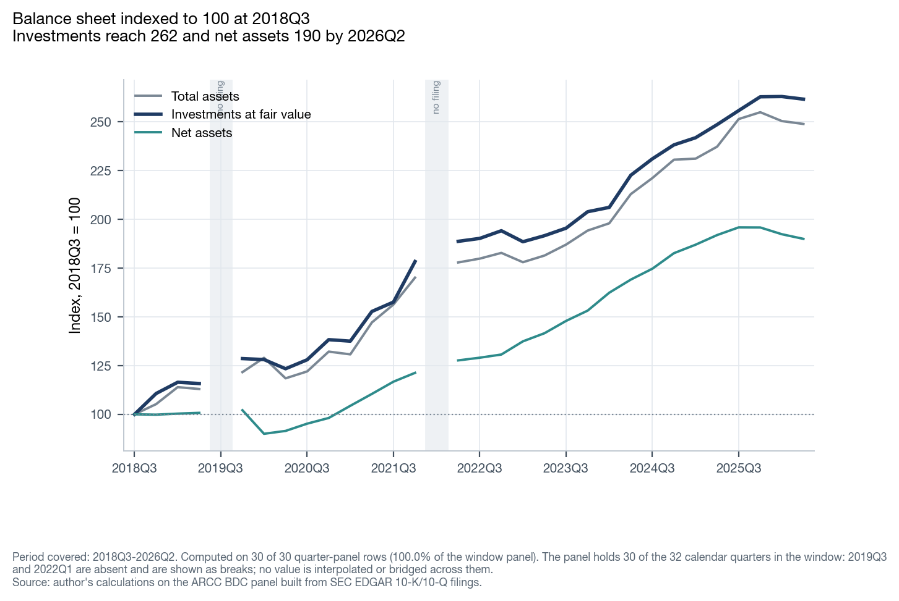

*Period covered: 2018Q3-2026Q2. Computed on 30 of 30 quarter-panel rows (100.0% of the window panel). The panel holds 30 of the 32 calendar quarters in the window: 2019Q3 and 2022Q1 are absent and are shown as breaks; no value is interpolated or bridged across them.*

*Source: author's calculations on the ARCC BDC panel built from SEC EDGAR 10-K/10-Q filings.*

## 4.2 Leverage

Debt to net assets rose from 0.622x in 2018Q3 to 1.135x in 2026Q2, first observed above 1.0x in 2020Q1 at 1.242x, peaking at 1.278x in 2022Q4, and standing above 1.0x in 24 of the 30 observed quarters. Debt to total assets went from 37.1% to 51.7%. Because 2019Q3 is unparsed and 2019Q4 prints 0.934x, a crossing above 1.0x inside 2019Q3 cannot be excluded. Debt is total debt outstanding as reported, gross of cash; this is not a regulatory asset-coverage ratio.

**Figure 16. Leverage: debt to net assets and debt to total assets**

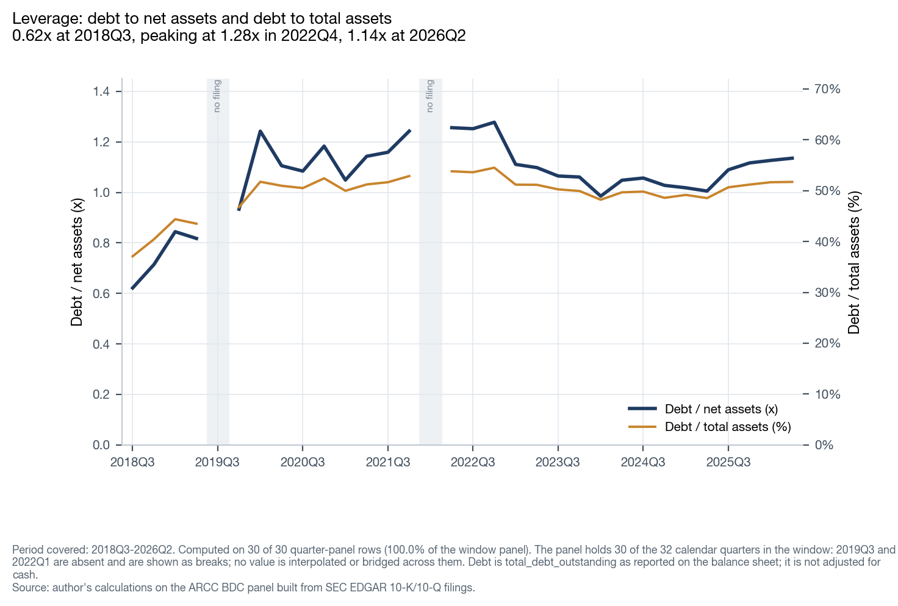

*Period covered: 2018Q3-2026Q2. Computed on 30 of 30 quarter-panel rows (100.0% of the window panel). The panel holds 30 of the 32 calendar quarters in the window: 2019Q3 and 2022Q1 are absent and are shown as breaks; no value is interpolated or bridged across them. Debt is total_debt_outstanding as reported on the balance sheet; it is not adjusted for cash.*

*Source: author's calculations on the ARCC BDC panel built from SEC EDGAR 10-K/10-Q filings.*

**Table 12. Leverage and NAV per share by quarter**

*Period covered: 2018Q3-2026Q2. Computed on 30 of 30 quarter-panel rows (100.0% of the window panel). The panel holds 30 of the 32 calendar quarters in the window: 2019Q3 and 2022Q1 are absent and are shown as breaks; no value is interpolated or bridged across them.*

| quarter   |   total_debt_usd_bn |   net_assets_usd_bn |   debt_net_assets_x |   debt_total_assets_pct |   nav_per_share_derived_usd | status           |
|:----------|--------------------:|--------------------:|--------------------:|------------------------:|----------------------------:|:-----------------|
| 2018Q3    |                4.55 |                7.31 |                0.62 |                   37.10 |                       17.17 | reported         |
| 2018Q4    |                5.21 |                7.30 |                0.71 |                   40.40 |                       17.14 | reported         |
| 2019Q1    |                6.20 |                7.34 |                0.84 |                   44.40 |                       17.23 | reported         |
| 2019Q2    |                6.02 |                7.37 |                0.82 |                   43.50 |                       17.26 | reported         |
| 2019Q3    |              nan    |              nan    |              nan    |                  nan    |                      nan    | no filing parsed |
| 2019Q4    |                6.97 |                7.47 |                0.93 |                   46.80 |                       17.32 | reported         |
| 2020Q1    |                8.18 |                6.58 |                1.24 |                   51.70 |                       15.56 | reported         |
| 2020Q2    |                7.40 |                6.69 |                1.11 |                   51.00 |                       15.82 | reported         |
| 2020Q3    |                7.55 |                6.96 |                1.08 |                   50.50 |                       16.46 | reported         |
| 2020Q4    |                8.49 |                7.18 |                1.18 |                   52.40 |                       16.96 | reported         |
| 2021Q1    |                8.01 |                7.63 |                1.05 |                   50.00 |                       17.46 | reported         |
| 2021Q2    |                9.23 |                8.08 |                1.14 |                   51.20 |                       18.15 | reported         |
| 2021Q3    |                9.89 |                8.54 |                1.16 |                   51.70 |                       18.52 | reported         |
| 2021Q4    |               11.02 |                8.87 |                1.24 |                   52.90 |                       18.95 | reported         |
| 2022Q1    |              nan    |              nan    |              nan    |                  nan    |                      nan    | no filing parsed |
| 2022Q2    |               11.73 |                9.34 |                1.26 |                   53.80 |                       18.82 | reported         |
| 2022Q3    |               11.82 |                9.44 |                1.25 |                   53.60 |                       18.57 | reported         |
| 2022Q4    |               12.21 |                9.55 |                1.28 |                   54.50 |                       18.41 | reported         |
| 2023Q1    |               11.16 |               10.05 |                1.11 |                   51.20 |                       18.44 | reported         |
| 2023Q2    |               11.37 |               10.35 |                1.10 |                   51.10 |                       18.59 | reported         |
| 2023Q3    |               11.52 |               10.81 |                1.06 |                   50.20 |                       19.01 | reported         |
| 2023Q4    |               11.88 |               11.20 |                1.06 |                   49.90 |                       19.25 | reported         |
| 2024Q1    |               11.70 |               11.87 |                0.98 |                   48.20 |                       19.53 | reported         |
| 2024Q2    |               12.96 |               12.36 |                1.05 |                   49.70 |                       19.63 | reported         |
| 2024Q3    |               13.50 |               12.77 |                1.06 |                   49.80 |                       19.77 | reported         |
| 2024Q4    |               13.73 |               13.36 |                1.03 |                   48.60 |                       19.87 | reported         |
| 2025Q1    |               13.92 |               13.67 |                1.02 |                   49.20 |                       19.81 | reported         |
| 2025Q2    |               14.11 |               14.03 |                1.00 |                   48.50 |                       19.88 | reported         |
| 2025Q3    |               15.61 |               14.32 |                1.09 |                   50.70 |                       20.00 | reported         |
| 2025Q4    |               15.99 |               14.32 |                1.12 |                   51.20 |                       19.94 | reported         |
| 2026Q1    |               15.85 |               14.06 |                1.13 |                   51.70 |                       19.59 | reported         |
| 2026Q2    |               15.77 |               13.89 |                1.14 |                   51.70 |                       19.35 | reported         |

*Note: NAV per share is derived as net_assets / shares_outstanding because the reported nav_per_share column is null in 27 of the 30 in-window quarters (90%).*

*Source: author's calculations on the ARCC BDC panel built from SEC EDGAR 10-K/10-Q filings.*

## 4.3 Asset mix

First lien rose from 44.1% of fair value in 2018Q3 to 59.1% in 2026Q2, +14.9pp, while second lien collapsed from 29.9% to 4.4%. Subordinated was essentially flat, 13.3% to 13.4%, and equity rose from 9.0% to 15.4%. The combined first-plus-second-lien share therefore fell from 74.0% to 63.5%: within its loan holdings the book moved up the capital structure, and at the same time it moved a larger share of its value into equity. On a count basis the same quarter holds 965 first-lien positions out of 1,439, 67.1% of rows against 59.1% of value.

**Figure 17. Asset mix drift: fair-value share by investment type**

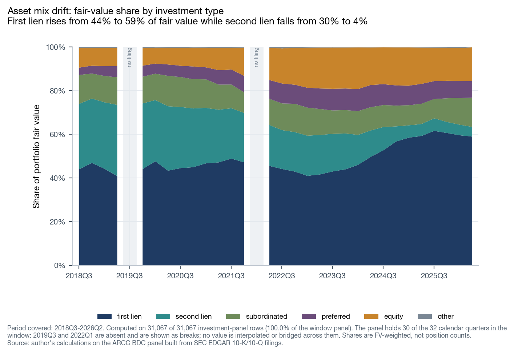

*Period covered: 2018Q3-2026Q2. Computed on 31,067 of 31,067 investment-panel rows (100.0% of the window panel). The panel holds 30 of the 32 calendar quarters in the window: 2019Q3 and 2022Q1 are absent and are shown as breaks; no value is interpolated or bridged across them. Shares are FV-weighted, not position counts.*

*Source: author's calculations on the ARCC BDC panel built from SEC EDGAR 10-K/10-Q filings.*

## 4.4 Reference-rate migration

Measured on the debt book by fair value, LIBOR was 89.6% of the book in 2018Q3 and 0.0% in 2026Q2, while SOFR first appears in 2022Q2 and reaches 88.2% by 2026Q2. The crossover takes one quarter: SOFR goes from 35.8% against LIBOR's 54.7% in 2023Q1 to 72.0% against 18.4% in 2023Q2, with the last non-zero LIBOR share in 2023Q3. The unclassified bucket, positions with no parsed reference rate, is 0.8% of debt-book fair value in 2018Q3 and 1.8% in 2026Q2; it stays in the denominator, so the migration is not an artefact of missingness, but the bucket is a parse residual and not an economic category.

**Figure 18. Reference-rate mix of the debt book, weighted by fair value**

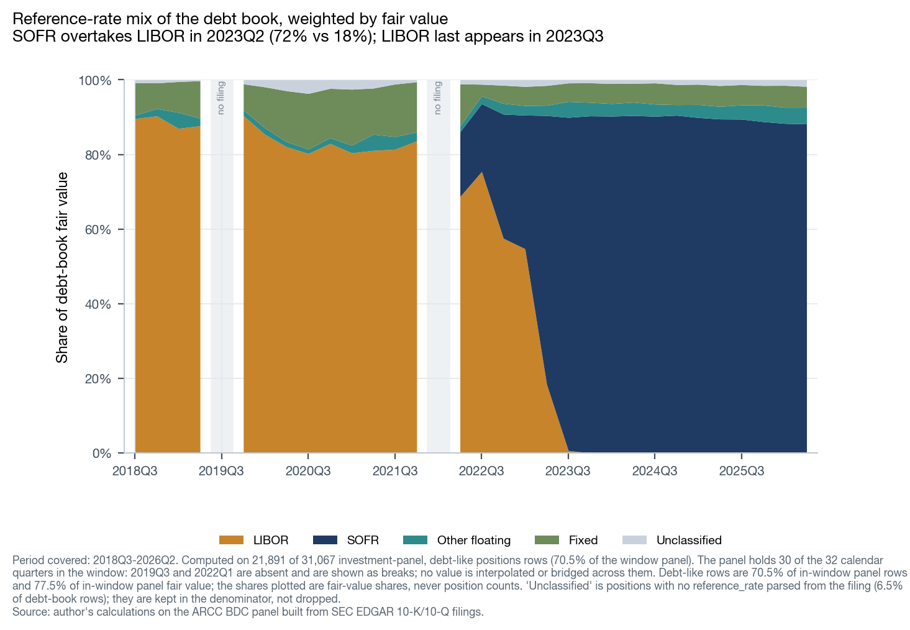

*Period covered: 2018Q3-2026Q2. Computed on 21,891 of 31,067 investment-panel, debt-like positions rows (70.5% of the window panel). The panel holds 30 of the 32 calendar quarters in the window: 2019Q3 and 2022Q1 are absent and are shown as breaks; no value is interpolated or bridged across them. Debt-like rows are 70.5% of in-window panel rows and 77.5% of in-window panel fair value; the shares plotted are fair-value shares, never position counts. 'Unclassified' is positions with no reference_rate parsed from the filing (6.5% of debt-book rows); they are kept in the denominator, not dropped.*

*Source: author's calculations on the ARCC BDC panel built from SEC EDGAR 10-K/10-Q filings.*

**Table 13. Reference-rate mix of the debt book by quarter (FV-weighted)**

*Period covered: 2018Q3-2026Q2. Computed on 21,891 of 31,067 investment-panel, debt-like positions rows (70.5% of the window panel). The panel holds 30 of the 32 calendar quarters in the window: 2019Q3 and 2022Q1 are absent and are shown as breaks; no value is interpolated or bridged across them. Debt-like rows are 70.5% of in-window panel rows and 77.5% of in-window panel fair value; the shares plotted are fair-value shares, never position counts.*

| quarter   |   LIBOR_pct_of_debt_fv |   SOFR_pct_of_debt_fv |   Other floating_pct_of_debt_fv |   Fixed_pct_of_debt_fv |   Unclassified_pct_of_debt_fv |   debt_book_fv_usd_bn | status           |
|:----------|-----------------------:|----------------------:|--------------------------------:|-----------------------:|------------------------------:|----------------------:|:-----------------|
| 2018Q3    |                  89.60 |                  0.00 |                            1.00 |                   8.70 |                          0.80 |                  9.79 | reported         |
| 2018Q4    |                  90.30 |                  0.00 |                            1.90 |                   6.90 |                          0.90 |                 10.92 | reported         |
| 2019Q1    |                  87.00 |                  0.00 |                            4.30 |                   8.30 |                          0.50 |                 11.34 | reported         |
| 2019Q2    |                  87.60 |                  0.00 |                            2.10 |                  10.00 |                          0.30 |                 11.20 | reported         |
| 2019Q3    |                 nan    |                nan    |                          nan    |                 nan    |                        nan    |                nan    | no filing parsed |
| 2019Q4    |                  90.40 |                  0.00 |                            1.50 |                   7.00 |                          1.10 |                 12.47 | reported         |
| 2020Q1    |                  85.30 |                  0.00 |                            1.80 |                  11.00 |                          1.90 |                 12.62 | reported         |
| 2020Q2    |                  82.00 |                  0.00 |                            1.40 |                  13.70 |                          3.00 |                 12.02 | reported         |
| 2020Q3    |                  80.20 |                  0.00 |                            1.20 |                  14.90 |                          3.70 |                 12.39 | reported         |
| 2020Q4    |                  82.90 |                  0.00 |                            1.60 |                  13.20 |                          2.30 |                 13.23 | reported         |
| 2021Q1    |                  80.40 |                  0.00 |                            2.00 |                  15.00 |                          2.60 |                 13.15 | reported         |
| 2021Q2    |                  81.10 |                  0.00 |                            4.30 |                  12.40 |                          2.30 |                 14.20 | reported         |
| 2021Q3    |                  81.40 |                  0.00 |                            3.40 |                  14.10 |                          1.20 |                 14.65 | reported         |
| 2021Q4    |                  83.60 |                  0.00 |                            2.40 |                  13.40 |                          0.60 |                 15.88 | reported         |
| 2022Q1    |                 nan    |                nan    |                          nan    |                 nan    |                        nan    |                nan    | no filing parsed |
| 2022Q2    |                  68.70 |                 17.40 |                            1.60 |                  11.30 |                          1.10 |                 16.16 | reported         |
| 2022Q3    |                  75.40 |                 18.20 |                            2.10 |                   3.10 |                          1.20 |                 15.84 | reported         |
| 2022Q4    |                  57.50 |                 33.30 |                            2.90 |                   4.80 |                          1.50 |                 16.13 | reported         |
| 2023Q1    |                  54.70 |                 35.80 |                            2.50 |                   5.10 |                          1.80 |                 15.29 | reported         |
| 2023Q2    |                  18.40 |                 72.00 |                            2.70 |                   5.30 |                          1.50 |                 15.41 | reported         |
| 2023Q3    |                   0.60 |                 89.30 |                            4.20 |                   5.00 |                          0.90 |                 15.57 | reported         |
| 2023Q4    |                   0.00 |                 90.30 |                            3.60 |                   5.20 |                          0.80 |                 16.28 | reported         |
| 2024Q1    |                   0.00 |                 90.20 |                            3.40 |                   5.40 |                          1.00 |                 16.35 | reported         |
| 2024Q2    |                   0.00 |                 90.40 |                            3.60 |                   5.00 |                          1.00 |                 18.11 | reported         |
| 2024Q3    |                   0.00 |                 90.20 |                            3.30 |                   5.70 |                          0.90 |                 19.04 | reported         |
| 2024Q4    |                   0.00 |                 90.50 |                            2.80 |                   5.40 |                          1.30 |                 19.57 | reported         |
| 2025Q1    |                   0.00 |                 89.90 |                            3.50 |                   5.40 |                          1.20 |                 19.91 | reported         |
| 2025Q2    |                   0.00 |                 89.50 |                            3.40 |                   5.60 |                          1.60 |                 20.66 | reported         |
| 2025Q3    |                   0.00 |                 89.40 |                            3.80 |                   5.40 |                          1.30 |                 21.88 | reported         |
| 2025Q4    |                   0.00 |                 88.80 |                            4.40 |                   5.30 |                          1.60 |                 22.58 | reported         |
| 2026Q1    |                   0.00 |                 88.30 |                            4.30 |                   5.80 |                          1.50 |                 22.65 | reported         |
| 2026Q2    |                   0.00 |                 88.20 |                            4.50 |                   5.60 |                          1.80 |                 22.55 | reported         |

*Note: Denominator each quarter is that quarter's debt-book fair value (first lien, second lien and subordinated only), so each row sums to 100%. Rows for 2019Q3 and 2022Q1 are blank by construction.*

*Source: author's calculations on the ARCC BDC panel built from SEC EDGAR 10-K/10-Q filings.*

## 4.5 Yield and spread

On the debt book, the fair-value-weighted all-in rate was 9.58% in 2018Q3, troughed at 7.82% in 2021Q4, peaked at 12.20% in 2023Q3 (a 438bps move off the trough) and was 9.49% in 2026Q2. The fair-value-weighted spread moved the other way across the full window: 707bps in 2018Q3, a 720bps peak in 2020Q3, a 568bps trough in 2026Q1 and 570bps in 2026Q2. Based on that pattern, the yield cycle in this book tracks the base rate rather than credit spreads, which drifted tighter throughout. One caution on the spread peak: 2020Q3 is also the worst-covered quarter for the spread field, at 81.4% of debt-book fair value, so it is the least reliable point on the series. Rate coverage is tighter and never falls below 96.3%.

**Figure 19. All-in rate and spread on the debt book, fair-value weighted**

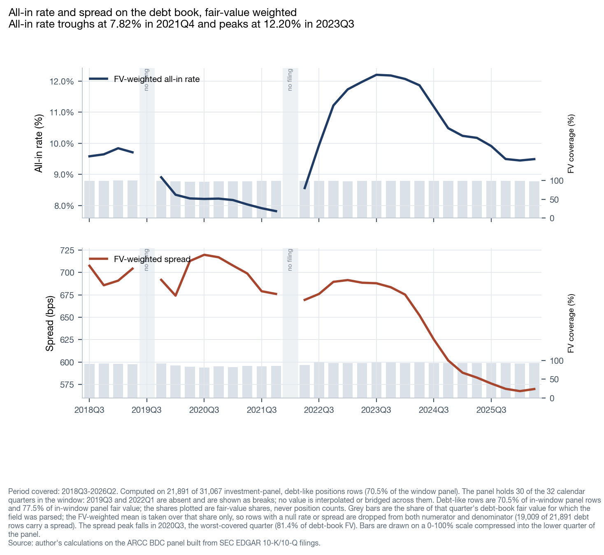

*Period covered: 2018Q3-2026Q2. Computed on 21,891 of 31,067 investment-panel, debt-like positions rows (70.5% of the window panel). The panel holds 30 of the 32 calendar quarters in the window: 2019Q3 and 2022Q1 are absent and are shown as breaks; no value is interpolated or bridged across them. Debt-like rows are 70.5% of in-window panel rows and 77.5% of in-window panel fair value; the shares plotted are fair-value shares, never position counts. Grey bars are the share of that quarter's debt-book fair value for which the field was parsed; the FV-weighted mean is taken over that share only, so rows with a null rate or spread are dropped from both numerator and denominator (19,009 of 21,891 debt rows carry a spread). The spread peak falls in 2020Q3, the worst-covered quarter (81.4% of debt-book FV). Bars are drawn on a 0-100% scale compressed into the lower quarter of the panel.*

*Source: author's calculations on the ARCC BDC panel built from SEC EDGAR 10-K/10-Q filings.*

## 4.6 Credit stress

The aggregate mark fell from 98.16% of cost in 2019Q4 to 92.77% in 2020Q1, a 5.4pp drawdown worth $1.120bn of net unrealised mark, first recovered above 100% in 2021Q2 at 100.23%, and was 98.90% in 2026Q2. Non-accruals peaked at 5.06% of cost and 3.18% of fair value in 2020Q3 (2020Q2 was 4.42% of cost and 2.58% of fair value) and were 2.38% and 1.38% in 2026Q2. The non-accrual series is drawn on 27 of the 30 quarters: 2022Q4, 2023Q4 and 2024Q4 return exactly zero parsed flags while neighbouring quarters carry 13 to 22, which is a footnote-marker parse failure and not a clean book.

**Figure 20. Credit stress: non-accrual share and aggregate fair value to cost**

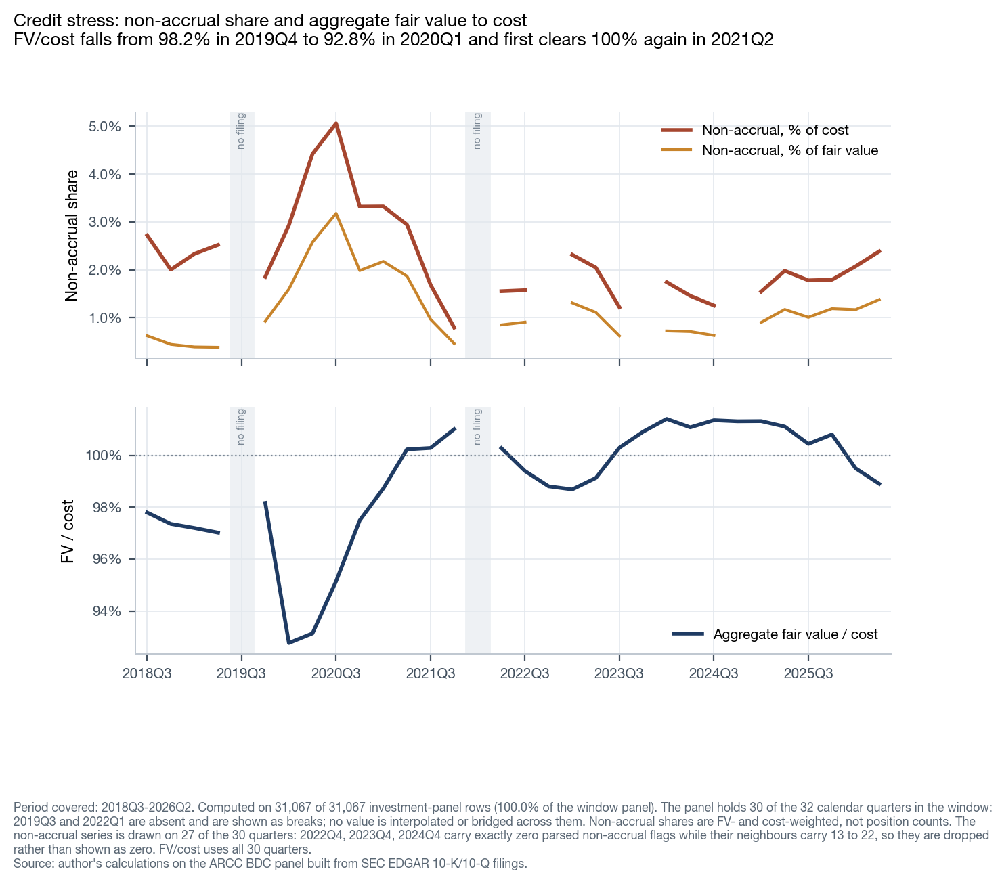

*Period covered: 2018Q3-2026Q2. Computed on 31,067 of 31,067 investment-panel rows (100.0% of the window panel). The panel holds 30 of the 32 calendar quarters in the window: 2019Q3 and 2022Q1 are absent and are shown as breaks; no value is interpolated or bridged across them. Non-accrual shares are FV- and cost-weighted, not position counts. The non-accrual series is drawn on 27 of the 30 quarters: 2022Q4, 2023Q4, 2024Q4 carry exactly zero parsed non-accrual flags while their neighbours carry 13 to 22, so they are dropped rather than shown as zero. FV/cost uses all 30 quarters.*

*Source: author's calculations on the ARCC BDC panel built from SEC EDGAR 10-K/10-Q filings.*

**Table 14. Marks and non-accruals by quarter**

*Period covered: 2018Q3-2026Q2. Computed on 31,067 of 31,067 investment-panel rows (100.0% of the window panel). The panel holds 30 of the 32 calendar quarters in the window: 2019Q3 and 2022Q1 are absent and are shown as breaks; no value is interpolated or bridged across them.*

| quarter   |   fair_value_usd_bn |   cost_usd_bn |   fv_over_cost_pct |   non_accrual_pct_of_cost |   non_accrual_pct_of_fv |   non_accrual_positions_n | status                                |
|:----------|--------------------:|--------------:|-------------------:|--------------------------:|------------------------:|--------------------------:|:--------------------------------------|
| 2018Q3    |               11.22 |         11.47 |              97.79 |                      2.72 |                    0.62 |                     26.00 | reported                              |
| 2018Q4    |               12.42 |         12.75 |              97.36 |                      2.00 |                    0.44 |                     22.00 | reported                              |
| 2019Q1    |               13.06 |         13.44 |              97.20 |                      2.33 |                    0.39 |                     27.00 | reported                              |
| 2019Q2    |               12.99 |         13.39 |              97.02 |                      2.52 |                    0.38 |                     30.00 | reported                              |
| 2019Q3    |              nan    |        nan    |             nan    |                    nan    |                  nan    |                    nan    | no filing parsed                      |
| 2019Q4    |               14.43 |         14.70 |              98.16 |                      1.85 |                    0.92 |                     18.00 | reported                              |
| 2020Q1    |               14.37 |         15.49 |              92.77 |                      2.93 |                    1.60 |                     22.00 | reported                              |
| 2020Q2    |               13.84 |         14.86 |              93.14 |                      4.42 |                    2.58 |                     28.00 | reported                              |
| 2020Q3    |               14.36 |         15.09 |              95.15 |                      5.06 |                    3.18 |                     26.00 | reported                              |
| 2020Q4    |               15.52 |         15.91 |              97.49 |                      3.32 |                    1.98 |                     19.00 | reported                              |
| 2021Q1    |               15.43 |         15.63 |              98.72 |                      3.32 |                    2.18 |                     21.00 | reported                              |
| 2021Q2    |               17.14 |         17.10 |             100.23 |                      2.94 |                    1.87 |                     20.00 | reported                              |
| 2021Q3    |               17.68 |         17.63 |             100.28 |                      1.69 |                    0.97 |                     12.00 | reported                              |
| 2021Q4    |               20.01 |         19.81 |             101.01 |                      0.79 |                    0.46 |                     11.00 | reported                              |
| 2022Q1    |              nan    |        nan    |             nan    |                    nan    |                  nan    |                    nan    | no filing parsed                      |
| 2022Q2    |               21.17 |         21.11 |             100.28 |                      1.55 |                    0.85 |                     15.00 | reported                              |
| 2022Q3    |               21.34 |         21.47 |              99.39 |                      1.57 |                    0.91 |                     13.00 | reported                              |
| 2022Q4    |               21.78 |         22.04 |              98.81 |                    nan    |                  nan    |                      0.00 | reported; non-accrual flag not parsed |
| 2023Q1    |               21.15 |         21.43 |              98.69 |                      2.32 |                    1.31 |                     15.00 | reported                              |
| 2023Q2    |               21.50 |         21.69 |              99.13 |                      2.05 |                    1.11 |                     20.00 | reported                              |
| 2023Q3    |               21.93 |         21.86 |             100.30 |                      1.22 |                    0.62 |                     14.00 | reported                              |
| 2023Q4    |               22.87 |         22.67 |             100.91 |                    nan    |                  nan    |                      0.00 | reported; non-accrual flag not parsed |
| 2024Q1    |               23.12 |         22.80 |             101.40 |                      1.74 |                    0.72 |                     22.00 | reported                              |
| 2024Q2    |               24.97 |         24.71 |             101.08 |                      1.46 |                    0.71 |                     21.00 | reported                              |
| 2024Q3    |               25.92 |         25.57 |             101.35 |                      1.25 |                    0.63 |                     23.00 | reported                              |
| 2024Q4    |               26.72 |         26.37 |             101.31 |                    nan    |                  nan    |                      0.00 | reported; non-accrual flag not parsed |
| 2025Q1    |               27.13 |         26.78 |             101.32 |                      1.54 |                    0.90 |                     18.00 | reported                              |
| 2025Q2    |               27.89 |         27.58 |             101.11 |                      1.98 |                    1.17 |                     21.00 | reported                              |
| 2025Q3    |               28.69 |         28.57 |             100.44 |                      1.78 |                    1.01 |                     21.00 | reported                              |
| 2025Q4    |               29.48 |         29.25 |             100.80 |                      1.79 |                    1.19 |                     19.00 | reported                              |
| 2026Q1    |               29.50 |         29.65 |              99.50 |                      2.07 |                    1.17 |                     26.00 | reported                              |
| 2026Q2    |               29.35 |         29.68 |              98.90 |                      2.38 |                    1.38 |                     32.00 | reported                              |

*Note: Position-level fair value sums to the reported balance-sheet total_investments_fv in every one of the 30 quarters (max relative difference 4.5e-05), which is the tie-out used to validate mixing the two panels.*

*Source: author's calculations on the ARCC BDC panel built from SEC EDGAR 10-K/10-Q filings.*

---

# 5. Deal terms

**Finding.** Pricing on this book tightened across seniorities: the pooled fair-value-weighted first-lien median spread is 565bps and the 2026Q2 median is 525bps, the second-lien premium over first lien narrowed from 225bps to 150bps between the endpoints, and the tenor of the debt book shortened from 5.23 to 4.68 weighted-average years. Spread level says very little about where the marks went; accrual status says almost everything.

## 5.1 Spread by seniority

Pooled over the window, first-lien spreads have a fair-value-weighted median of 565bps with a 500-640bps interquartile range on 93.4% fair-value coverage of the first-lien bucket; second lien is 788bps on 93.7% coverage; subordinated is 800bps but on only 76.1% coverage, and its `spread_bps` field is 63.4% null by row, so its level is indicative only. In 2026Q2 the medians are 525bps first lien (95.8% cell coverage), 675bps second lien (84.3%) and 676bps subordinated (81.4%).

**Figure 21. Spread by seniority: interquartile range and median**

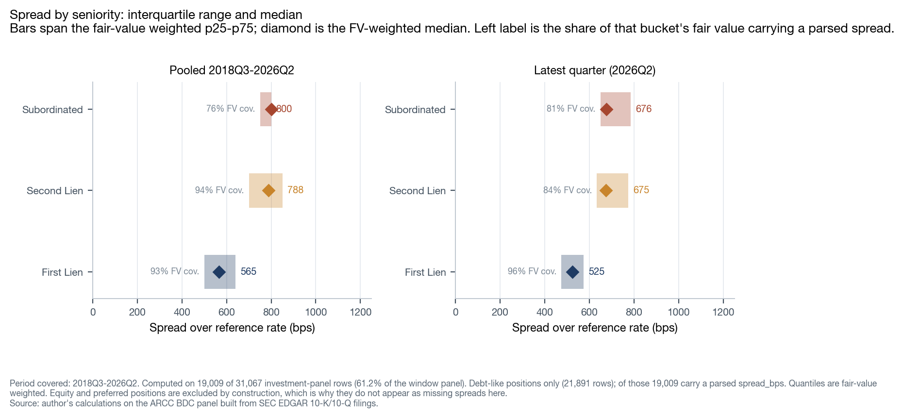

*Period covered: 2018Q3-2026Q2. Computed on 19,009 of 31,067 investment-panel rows (61.2% of the window panel). Debt-like positions only (21,891 rows); of those 19,009 carry a parsed spread_bps. Quantiles are fair-value weighted. Equity and preferred positions are excluded by construction, which is why they do not appear as missing spreads here.*

*Source: author's calculations on the ARCC BDC panel built from SEC EDGAR 10-K/10-Q filings.*

**Table 15. Fair-value weighted spread distribution by seniority**

*Period covered: 2018Q3-2026Q2. Computed on 19,009 of 31,067 investment-panel rows (61.2% of the window panel). Debt-like positions only (21,891 rows); of those 19,009 carry a parsed spread_bps. Quantiles are fair-value weighted. Equity and preferred positions are excluded by construction, which is why they do not appear as missing spreads here.*

| scope                   | seniority    |   positions |   positions_with_spread |   median_spread_bps |   p25_spread_bps |   p75_spread_bps |   iqr_bps |   fv_with_spread_usd_mm |   fv_coverage_pct_of_cell |   fv_coverage_pct_of_debt_book |
|:------------------------|:-------------|------------:|------------------------:|--------------------:|-----------------:|-----------------:|----------:|------------------------:|--------------------------:|-------------------------------:|
| pooled 2018Q3-2026Q2    | first lien   |       18868 |                   16853 |              565.00 |           500.00 |           640.00 |    140.00 |              288,246.10 |                     93.42 |                          60.32 |
| pooled 2018Q3-2026Q2    | second lien  |        1982 |                    1775 |              788.00 |           700.00 |           850.00 |    150.00 |               92,912.90 |                     93.70 |                          19.44 |
| pooled 2018Q3-2026Q2    | subordinated |        1041 |                     381 |              800.00 |           750.00 |           800.00 |     50.00 |               53,366.00 |                     76.07 |                          11.17 |
| latest quarter (2026Q2) | first lien   |         965 |                     883 |              525.00 |           475.00 |           575.00 |    100.00 |               16,606.60 |                     95.81 |                          73.65 |
| latest quarter (2026Q2) | second lien  |          25 |                      18 |              675.00 |           633.89 |           775.00 |    141.11 |                1,090.20 |                     84.28 |                           4.84 |
| latest quarter (2026Q2) | subordinated |          53 |                      31 |              676.33 |           650.00 |           784.58 |    134.58 |                3,191.50 |                     81.37 |                          14.15 |

*Note: Quantiles are fair-value weighted over positions with a parsed spread. 'fv_coverage_pct_of_cell' is the share of that seniority bucket's fair value that carries a spread; the subordinated bucket is the weak cell and its median should be read as indicative only.*

*Source: author's calculations on the ARCC BDC panel built from SEC EDGAR 10-K/10-Q filings.*

Through time, the first-lien median peaked at 625bps in 2023Q2 and 2023Q3 (a tie the exhibit reports at its first occurrence) and troughed at 500bps in both 2025Q4 and 2026Q1. The second-minus-first-lien differential fell from 225bps in 2018Q3 to 150bps in 2026Q2, a 75bps endpoint change, but the path is not a compression trend: it reaches 125bps in 2023Q2-Q3, rebounds to 240bps in 2024Q4, then falls again. A seniority cell is dropped, not interpolated, when it has fewer than 5 spread-bearing positions or under 40% cell fair-value coverage, which removes the subordinated series in 4 of the 30 observed quarters.

**Figure 22. Spread by seniority through time, and the second-to-first lien differential**

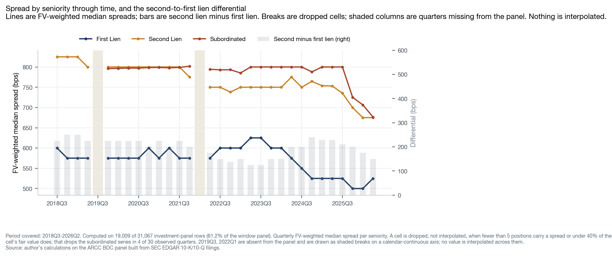

*Period covered: 2018Q3-2026Q2. Computed on 19,009 of 31,067 investment-panel rows (61.2% of the window panel). Quarterly FV-weighted median spread per seniority. A cell is dropped, not interpolated, when fewer than 5 positions carry a spread or under 40% of the cell's fair value does; that drops the subordinated series in 4 of 30 observed quarters. 2019Q3, 2022Q1 are absent from the panel and are drawn as shaded breaks on a calendar-continuous axis; no value is interpolated across them.*

*Source: author's calculations on the ARCC BDC panel built from SEC EDGAR 10-K/10-Q filings.*

**Table 16. Quarterly fair-value weighted median spread by seniority**

*Period covered: 2018Q3-2026Q2. Computed on 19,009 of 31,067 investment-panel rows (61.2% of the window panel). Quarterly FV-weighted median spread per seniority. A cell is dropped, not interpolated, when fewer than 5 positions carry a spread or under 40% of the cell's fair value does; that drops the subordinated series in 4 of 30 observed quarters. 2019Q3, 2022Q1 are absent from the panel and are drawn as shaded breaks on a calendar-continuous axis; no value is interpolated across them.*

| quarter   |   first lien |   first lien_fv_cov_pct |   first lien_n_with_spread |   second lien |   second lien_fv_cov_pct |   second lien_n_with_spread |   subordinated |   subordinated_fv_cov_pct |   subordinated_n_with_spread |   n_debt_with_spread |   fl_sl_diff_bps |
|:----------|-------------:|------------------------:|---------------------------:|--------------:|-------------------------:|----------------------------:|---------------:|--------------------------:|-----------------------------:|---------------------:|-----------------:|
| 2018Q3    |       600.00 |                   95.18 |                        363 |        825.00 |                    99.10 |                          87 |         nan    |                     55.79 |                            3 |                  453 |           225.00 |
| 2018Q4    |       575.00 |                   95.55 |                        388 |        825.00 |                    99.32 |                          95 |         nan    |                     60.56 |                            3 |                  486 |           250.00 |
| 2019Q1    |       575.00 |                   93.39 |                        417 |        825.00 |                    99.15 |                          99 |         nan    |                     63.43 |                            3 |                  519 |           250.00 |
| 2019Q2    |       575.00 |                   90.52 |                        367 |        800.00 |                    96.99 |                          91 |         nan    |                     68.40 |                            3 |                  461 |           225.00 |
| 2019Q4    |       575.00 |                   92.45 |                        331 |        800.00 |                    98.33 |                          89 |         796.10 |                     74.20 |                            5 |                  425 |           225.00 |
| 2020Q1    |       575.00 |                   90.48 |                        409 |        800.00 |                    87.07 |                          79 |         796.60 |                     73.63 |                            7 |                  495 |           225.00 |
| 2020Q2    |       575.00 |                   81.75 |                        335 |        800.00 |                    93.05 |                          92 |         797.28 |                     67.94 |                            6 |                  433 |           225.00 |
| 2020Q3    |       575.00 |                   77.45 |                        298 |        800.00 |                    94.24 |                          89 |         797.30 |                     68.18 |                            6 |                  393 |           225.00 |
| 2020Q4    |       600.00 |                   82.11 |                        310 |        800.00 |                    95.08 |                          87 |         798.54 |                     71.05 |                            7 |                  404 |           200.00 |
| 2021Q1    |       575.00 |                   80.44 |                        328 |        800.00 |                    93.61 |                          80 |         798.79 |                     67.97 |                            7 |                  415 |           225.00 |
| 2021Q2    |       600.00 |                   86.37 |                        326 |        800.00 |                    94.05 |                          67 |         798.00 |                     63.22 |                            6 |                  399 |           200.00 |
| 2021Q3    |       575.00 |                   86.62 |                        339 |        800.00 |                    89.63 |                          65 |         798.83 |                     66.11 |                            6 |                  410 |           225.00 |
| 2021Q4    |       575.00 |                   86.83 |                        386 |        775.00 |                    94.05 |                          63 |         801.83 |                     62.47 |                            5 |                  454 |           200.00 |
| 2022Q2    |       575.00 |                   87.63 |                        481 |        750.00 |                    98.24 |                          65 |         794.34 |                     71.07 |                           10 |                  556 |           175.00 |
| 2022Q3    |       600.00 |                   98.78 |                        536 |        750.00 |                    97.05 |                          63 |         792.89 |                     82.33 |                           12 |                  611 |           150.00 |
| 2022Q4    |       600.00 |                   96.03 |                        568 |        738.01 |                    96.78 |                          62 |         793.25 |                     81.50 |                           12 |                  642 |           138.01 |
| 2023Q1    |       600.00 |                   95.67 |                        584 |        750.00 |                    95.73 |                          61 |         785.21 |                     80.88 |                           10 |                  655 |           150.00 |
| 2023Q2    |       625.00 |                   95.45 |                        694 |        750.00 |                    93.87 |                          63 |         800.00 |                     83.94 |                           13 |                  770 |           125.00 |
| 2023Q3    |       625.00 |                   95.94 |                        636 |        750.00 |                    94.79 |                          61 |         800.00 |                     85.95 |                           14 |                  711 |           125.00 |
| 2023Q4    |       600.00 |                   95.88 |                        663 |        750.00 |                    95.33 |                          56 |         800.00 |                     83.83 |                           15 |                  734 |           150.00 |
| 2024Q1    |       600.00 |                   95.97 |                        699 |        750.00 |                    93.70 |                          43 |         800.00 |                     83.44 |                           16 |                  758 |           150.00 |
| 2024Q2    |       575.00 |                   96.91 |                        744 |        775.00 |                    93.94 |                          42 |         800.00 |                     80.34 |                           17 |                  803 |           200.00 |
| 2024Q3    |       550.00 |                   96.46 |                        742 |        750.00 |                    93.14 |                          39 |         800.00 |                     77.96 |                           17 |                  798 |           200.00 |
| 2024Q4    |       525.00 |                   96.21 |                        786 |        764.52 |                    89.95 |                          29 |         787.93 |                     78.36 |                           21 |                  836 |           239.52 |
| 2025Q1    |       525.00 |                   96.58 |                        816 |        753.70 |                    85.19 |                          18 |         800.00 |                     77.76 |                           23 |                  857 |           228.70 |
| 2025Q2    |       525.00 |                   96.32 |                        853 |        753.19 |                    78.60 |                          16 |         800.00 |                     79.17 |                           26 |                  895 |           228.19 |
| 2025Q3    |       525.00 |                   96.53 |                        846 |        735.20 |                    80.42 |                          18 |         800.00 |                     78.57 |                           25 |                  889 |           210.20 |
| 2025Q4    |       500.00 |                   96.05 |                        858 |        699.75 |                    81.18 |                          19 |         725.00 |                     82.77 |                           25 |                  902 |           199.75 |
| 2026Q1    |       500.00 |                   95.91 |                        867 |        675.00 |                    76.80 |                          19 |         706.49 |                     82.94 |                           27 |                  913 |           175.00 |
| 2026Q2    |       525.00 |                   95.81 |                        883 |        675.00 |                    84.28 |                          18 |         676.33 |                     81.37 |                           31 |                  932 |           150.00 |

*Note: One row per observed quarter: NaN entries are deliberate drops (thin or poorly covered cells), and 2019Q3, 2022Q1 are absent from the panel and are drawn as shaded breaks on a calendar-continuous axis; no value is interpolated across them. They have no row in this table.*

*Source: author's calculations on the ARCC BDC panel built from SEC EDGAR 10-K/10-Q filings.*

## 5.2 Decomposing the all-in rate

On floating-rate debt positions carrying both a parsed all-in rate and a parsed spread, the fair-value-weighted all-in rate troughed at 7.56% in 2021Q4, peaked at 12.34% in 2023Q3 and was 9.38% in 2026Q2, with the 2026Q2 spread component at 570bps. Subtracting spread from all-in rate gives an implied base rate of 2.33% in 2018Q3, 0.80% at the 2021Q4 trough, 5.46% at the 2023Q4 peak and 3.68% in 2026Q2. This is an inference, not a measurement: no SOFR or LIBOR series exists in this dataset, the residual inherits every parse error in both input fields, and its level is contaminated by PIK components, rate floors and the pooling of 17 distinct reference-rate labels including non-USD rates. Based on that pattern alone, the shape is consistent with the 2020 easing and the 2022-2023 tightening cycle.

**Figure 23. All-in yield decomposed into spread and implied base rate**

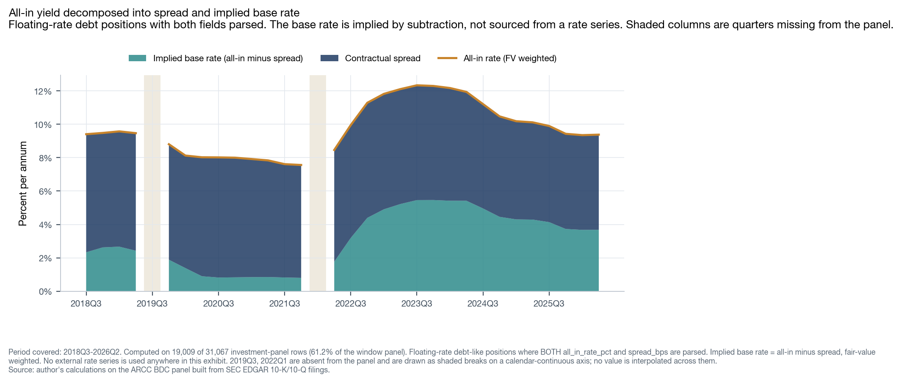

*Period covered: 2018Q3-2026Q2. Computed on 19,009 of 31,067 investment-panel rows (61.2% of the window panel). Floating-rate debt-like positions where BOTH all_in_rate_pct and spread_bps are parsed. Implied base rate = all-in minus spread, fair-value weighted. No external rate series is used anywhere in this exhibit. 2019Q3, 2022Q1 are absent from the panel and are drawn as shaded breaks on a calendar-continuous axis; no value is interpolated across them.*

*Source: author's calculations on the ARCC BDC panel built from SEC EDGAR 10-K/10-Q filings.*

**Table 17. All-in rate, contractual spread and implied base rate by quarter**

*Period covered: 2018Q3-2026Q2. Computed on 19,009 of 31,067 investment-panel rows (61.2% of the window panel). Floating-rate debt-like positions where BOTH all_in_rate_pct and spread_bps are parsed. Implied base rate = all-in minus spread, fair-value weighted. No external rate series is used anywhere in this exhibit. 2019Q3, 2022Q1 are absent from the panel and are drawn as shaded breaks on a calendar-continuous axis; no value is interpolated across them.*

| quarter   |   fv_wtd_all_in_pct |   fv_wtd_spread_pct |   implied_base_pct |   n_positions |   fv_coverage_pct_of_debt_book |
|:----------|--------------------:|--------------------:|-------------------:|--------------:|-------------------------------:|
| 2018Q3    |                9.41 |                7.07 |               2.33 |           453 |                          90.54 |
| 2018Q4    |                9.48 |                6.86 |               2.62 |           486 |                          92.25 |
| 2019Q1    |                9.58 |                6.91 |               2.67 |           519 |                          91.24 |
| 2019Q2    |                9.47 |                7.04 |               2.43 |           461 |                          89.72 |
| 2019Q4    |                8.80 |                6.92 |               1.89 |           425 |                          91.91 |
| 2020Q1    |                8.13 |                6.74 |               1.39 |           495 |                          87.07 |
| 2020Q2    |                8.02 |                7.13 |               0.90 |           433 |                          83.37 |
| 2020Q3    |                8.02 |                7.20 |               0.82 |           393 |                          81.42 |
| 2020Q4    |                8.00 |                7.17 |               0.83 |           404 |                          84.47 |
| 2021Q1    |                7.92 |                7.08 |               0.84 |           415 |                          82.44 |
| 2021Q2    |                7.84 |                6.99 |               0.85 |           399 |                          85.39 |
| 2021Q3    |                7.61 |                6.79 |               0.82 |           410 |                          84.76 |
| 2021Q4    |                7.56 |                6.76 |               0.80 |           454 |                          85.99 |
| 2022Q2    |                8.46 |                6.69 |               1.77 |           556 |                          87.63 |
| 2022Q3    |                9.95 |                6.76 |               3.19 |           611 |                          95.65 |
| 2022Q4    |               11.29 |                6.89 |               4.39 |           642 |                          93.67 |
| 2023Q1    |               11.82 |                6.91 |               4.91 |           655 |                          93.06 |
| 2023Q2    |               12.11 |                6.88 |               5.22 |           770 |                          93.14 |
| 2023Q3    |               12.34 |                6.88 |               5.46 |           711 |                          94.16 |
| 2023Q4    |               12.30 |                6.83 |               5.46 |           734 |                          93.94 |
| 2024Q1    |               12.17 |                6.75 |               5.42 |           758 |                          93.60 |
| 2024Q2    |               11.94 |                6.52 |               5.42 |           803 |                          93.98 |
| 2024Q3    |               11.21 |                6.25 |               4.96 |           798 |                          93.45 |
| 2024Q4    |               10.47 |                6.02 |               4.46 |           836 |                          93.30 |
| 2025Q1    |               10.18 |                5.88 |               4.30 |           857 |                          93.34 |
| 2025Q2    |               10.12 |                5.83 |               4.29 |           895 |                          92.86 |
| 2025Q3    |                9.90 |                5.76 |               4.14 |           889 |                          93.23 |
| 2025Q4    |                9.43 |                5.70 |               3.73 |           902 |                          93.19 |
| 2026Q1    |                9.35 |                5.67 |               3.67 |           913 |                          92.63 |
| 2026Q2    |                9.38 |                5.70 |               3.68 |           932 |                          92.64 |

*Note: Implied base = FV-weighted (all_in_rate_pct - spread_bps/100) on floating positions with both fields present. Reading its path as the policy cycle is an inference from the filings, not an external measurement.*

*Source: author's calculations on the ARCC BDC panel built from SEC EDGAR 10-K/10-Q filings.*

## 5.3 Fixed versus floating

The debt book is overwhelmingly floating and became slightly more so: 90.5% of debt-book fair value in 2018Q3 against 92.6% in 2026Q2, with fixed falling from 8.7% to 5.6% and 1.8% of 2026Q2 debt fair value undisclosed. The window mean is 90.5% floating and the minimum 81.4% in 2020Q3, which is a disclosure artefact of that quarter rather than a shift into fixed-rate lending: undisclosed positions are shown as their own band and are never reallocated.

**Figure 24. Fixed versus floating share of the debt book**

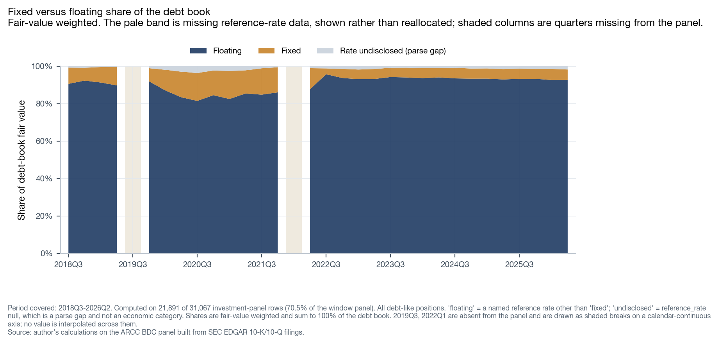

*Period covered: 2018Q3-2026Q2. Computed on 21,891 of 31,067 investment-panel rows (70.5% of the window panel). All debt-like positions. 'floating' = a named reference rate other than 'fixed'; 'undisclosed' = reference_rate null, which is a parse gap and not an economic category. Shares are fair-value weighted and sum to 100% of the debt book. 2019Q3, 2022Q1 are absent from the panel and are drawn as shaded breaks on a calendar-continuous axis; no value is interpolated across them.*

*Source: author's calculations on the ARCC BDC panel built from SEC EDGAR 10-K/10-Q filings.*

## 5.4 Maturity structure

Weighted-average years to maturity on the dated debt book fell from 5.23 years in 2018Q3 to 4.68 years in 2026Q2, the window minimum, against a 5.58-year maximum in 2019Q2. Of 21,891 debt rows, 325 carry no parsable maturity date and a further 178 carry a maturity before the period end and are excluded as stale or mis-parsed rather than reported as negative tenor.

**Figure 25. Maturity structure of the debt book**

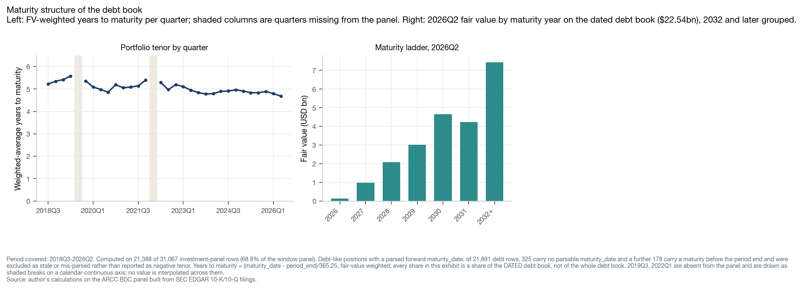

*Period covered: 2018Q3-2026Q2. Computed on 21,388 of 31,067 investment-panel rows (68.8% of the window panel). Debt-like positions with a parsed forward maturity_date: of 21,891 debt rows, 325 carry no parsable maturity_date and a further 178 carry a maturity before the period end and were excluded as stale or mis-parsed rather than reported as negative tenor. Years to maturity = (maturity_date - period_end)/365.25, fair-value weighted; every share in this exhibit is a share of the DATED debt book, not of the whole debt book. 2019Q3, 2022Q1 are absent from the panel and are drawn as shaded breaks on a calendar-continuous axis; no value is interpolated across them.*

*Source: author's calculations on the ARCC BDC panel built from SEC EDGAR 10-K/10-Q filings.*

**Table 18. Weighted-average tenor and near-dated maturity shares by quarter**

*Period covered: 2018Q3-2026Q2. Computed on 21,388 of 31,067 investment-panel rows (68.8% of the window panel). Debt-like positions with a parsed forward maturity_date: of 21,891 debt rows, 325 carry no parsable maturity_date and a further 178 carry a maturity before the period end and were excluded as stale or mis-parsed rather than reported as negative tenor. Years to maturity = (maturity_date - period_end)/365.25, fair-value weighted; every share in this exhibit is a share of the DATED debt book, not of the whole debt book. 2019Q3, 2022Q1 are absent from the panel and are drawn as shaded breaks on a calendar-continuous axis; no value is interpolated across them.*

| quarter   |   wa_years_to_maturity |   pct_fv_maturing_le_1y |   pct_fv_maturing_le_3y |   pct_fv_maturing_le_5y |   n_positions |   fv_coverage_pct_of_debt_book |
|:----------|-----------------------:|------------------------:|------------------------:|------------------------:|--------------:|-------------------------------:|
| 2018Q3    |                   5.23 |                    2.49 |                   22.85 |                   62.54 |           507 |                          99.80 |
| 2018Q4    |                   5.35 |                    2.52 |                   22.88 |                   56.00 |           530 |                          99.81 |
| 2019Q1    |                   5.42 |                    3.67 |                   22.74 |                   56.61 |           571 |                          99.84 |
| 2019Q2    |                   5.58 |                    4.32 |                   20.58 |                   54.65 |           542 |                          99.91 |
| 2019Q4    |                   5.36 |                    2.58 |                   19.87 |                   56.27 |           479 |                          99.92 |
| 2020Q1    |                   5.09 |                    2.66 |                   21.72 |                   57.19 |           575 |                          99.95 |
| 2020Q2    |                   4.98 |                    3.32 |                   29.09 |                   59.36 |           517 |                          99.95 |
| 2020Q3    |                   4.86 |                    5.21 |                   31.68 |                   59.60 |           500 |                          99.94 |
| 2020Q4    |                   5.19 |                    4.12 |                   25.65 |                   58.08 |           511 |                          99.97 |
| 2021Q1    |                   5.06 |                    3.83 |                   25.48 |                   65.01 |           524 |                          99.97 |
| 2021Q2    |                   5.09 |                    3.18 |                   23.80 |                   58.70 |           486 |                          99.96 |
| 2021Q3    |                   5.14 |                    3.30 |                   22.80 |                   54.77 |           503 |                         100.00 |
| 2021Q4    |                   5.40 |                    2.89 |                   20.15 |                   49.95 |           542 |                          99.98 |
| 2022Q2    |                   5.29 |                    2.44 |                   16.98 |                   50.47 |           644 |                          99.98 |
| 2022Q3    |                   4.97 |                    8.50 |                   22.28 |                   55.36 |           671 |                          99.58 |
| 2022Q4    |                   5.20 |                    3.90 |                   23.24 |                   50.55 |           700 |                          99.49 |
| 2023Q1    |                   5.11 |                    2.71 |                   23.40 |                   50.95 |           712 |                          99.79 |
| 2023Q2    |                   4.95 |                    3.59 |                   22.87 |                   54.26 |           836 |                          99.77 |
| 2023Q3    |                   4.84 |                    4.47 |                   26.14 |                   53.14 |           773 |                          99.98 |
| 2023Q4    |                   4.78 |                    4.72 |                   27.58 |                   59.92 |           804 |                         100.00 |
| 2024Q1    |                   4.79 |                    3.50 |                   24.56 |                   57.25 |           827 |                         100.00 |
| 2024Q2    |                   4.90 |                    1.76 |                   21.08 |                   57.45 |           870 |                         100.00 |
| 2024Q3    |                   4.91 |                    3.37 |                   20.46 |                   54.77 |           877 |                         100.00 |
| 2024Q4    |                   4.96 |                    4.68 |                   19.73 |                   56.41 |           922 |                         100.00 |
| 2025Q1    |                   4.91 |                    3.83 |                   19.70 |                   52.12 |           938 |                          99.78 |
| 2025Q2    |                   4.83 |                    2.40 |                   18.24 |                   53.20 |           970 |                          99.87 |
| 2025Q3    |                   4.83 |                    2.42 |                   17.01 |                   51.34 |           990 |                          99.89 |
| 2025Q4    |                   4.89 |                    2.64 |                   18.68 |                   52.96 |          1005 |                         100.00 |
| 2026Q1    |                   4.79 |                    1.44 |                   17.72 |                   54.79 |          1023 |                         100.00 |
| 2026Q2    |                   4.68 |                    2.19 |                   20.27 |                   56.76 |          1039 |                          99.95 |

*Note: Shares are cumulative: 'le_3y' includes everything in 'le_1y'. Denominator is the dated debt-book fair value of that quarter.*

*Source: author's calculations on the ARCC BDC panel built from SEC EDGAR 10-K/10-Q filings.*

The 2026Q2 ladder is computed on 1,039 dated positions worth $22.537bn, which is 99.95% of that quarter's $22.548bn debt book, not 100% of it. Only 2.2% of dated fair value matures within one year, 20.3% within three years and 56.8% within five, with 32.97% sitting in the open-ended 2032-and-later bucket.

**Table 19. Maturity ladder of the debt book, 2026Q2**

*Period covered: 2026Q2. Computed on 1,039 of 31,067 investment-panel rows (3.3% of the window panel). 2026Q2 debt-like positions with a parsed forward maturity date only (1,039 positions, $22.537bn, 99.95% of that quarter's $22.548bn debt-book fair value).*

| maturity_year   |   fair_value_usd_bn |   pct_of_dated_debt_fv |
|:----------------|--------------------:|-----------------------:|
| 2026            |                0.13 |                   0.57 |
| 2027            |                0.99 |                   4.38 |
| 2028            |                2.08 |                   9.25 |
| 2029            |                3.02 |                  13.41 |
| 2030            |                4.66 |                  20.66 |
| 2031            |                4.23 |                  18.76 |
| 2032+           |                7.43 |                  32.97 |

*Note: Fair value by calendar maturity year; final bucket is open-ended. Shares are of the dated debt book ($22.537bn), which is 99.95% of the 2026Q2 debt book, not 100% of it.*

*Source: author's calculations on the ARCC BDC panel built from SEC EDGAR 10-K/10-Q filings.*

## 5.5 Do wider spreads carry worse marks?

Barely, and not monotonically. Across the latest eight quarters (2024Q3-2026Q2) and 7,019 debt position-quarters sorted into 9 equal-count spread buckets, the tightest bucket (75-450bps) is marked at 0.9834x cost and the widest (725-1215bps) at 0.9764x, a gap of 0.70pp. The worst-marked bucket is the middle-of-the-range 600-625bps bucket at 0.9704x and the best is the 533-550bps bucket at 0.9967x. The rank correlation between bucket and mark is -0.583, computed on 9 bucket-level points rather than on 7,019 positions. This is an association and not a causal relationship: spread is set at origination and marks are struck later, and credit quality drives both. The exhibit is also survivorship-tilted upward, because non-accrual positions lose their parsed spread in the filing and are absent from every bucket by construction (0 of 156 non-accrual debt position-quarters in this window carry a spread).

**Figure 26. Do wider spreads carry worse marks?**

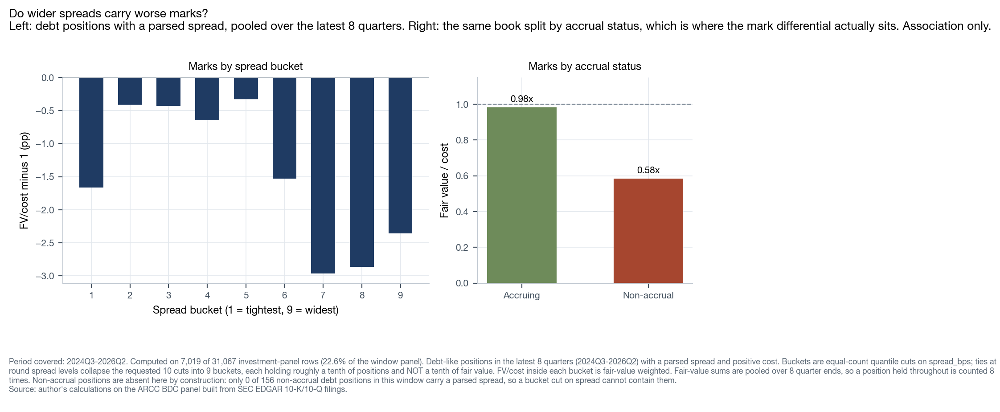

*Period covered: 2024Q3-2026Q2. Computed on 7,019 of 31,067 investment-panel rows (22.6% of the window panel). Debt-like positions in the latest 8 quarters (2024Q3-2026Q2) with a parsed spread and positive cost. Buckets are equal-count quantile cuts on spread_bps; ties at round spread levels collapse the requested 10 cuts into 9 buckets, each holding roughly a tenth of positions and NOT a tenth of fair value. FV/cost inside each bucket is fair-value weighted. Fair-value sums are pooled over 8 quarter ends, so a position held throughout is counted 8 times. Non-accrual positions are absent here by construction: only 0 of 156 non-accrual debt positions in this window carry a parsed spread, so a bucket cut on spread cannot contain them.*

*Source: author's calculations on the ARCC BDC panel built from SEC EDGAR 10-K/10-Q filings.*

**Table 20. Marks by spread bucket, latest 8 quarters**

*Period covered: 2024Q3-2026Q2. Computed on 7,019 of 31,067 investment-panel rows (22.6% of the window panel). Debt-like positions in the latest 8 quarters (2024Q3-2026Q2) with a parsed spread and positive cost. Buckets are equal-count quantile cuts on spread_bps; ties at round spread levels collapse the requested 10 cuts into 9 buckets, each holding roughly a tenth of positions and NOT a tenth of fair value. FV/cost inside each bucket is fair-value weighted. Fair-value sums are pooled over 8 quarter ends, so a position held throughout is counted 8 times. Non-accrual positions are absent here by construction: only 0 of 156 non-accrual debt positions in this window carry a parsed spread, so a bucket cut on spread cannot contain them.*

|   bucket | spread_range_bps   |   positions |   spread_bps_min |   spread_bps_max |   median_spread_bps |   fair_value_usd_mm |   fv_over_cost |   pct_marked_below_cost_by_fv |   non_accrual_positions |
|---------:|:-------------------|------------:|-----------------:|-----------------:|--------------------:|--------------------:|---------------:|------------------------------:|------------------------:|
|        1 | 75-450             |    1,097.00 |            75.00 |           450.00 |              450.00 |           17,205.30 |           0.98 |                         46.39 |                    0.00 |
|        2 | 468-475            |    1,111.00 |           468.00 |           475.00 |              475.00 |           20,608.80 |           1.00 |                         36.68 |                    0.00 |
|        3 | 480-500            |      982.00 |           480.00 |           500.00 |              500.00 |           21,250.00 |           1.00 |                         34.63 |                    0.00 |
|        4 | 508-525            |      719.00 |           508.00 |           525.00 |              525.00 |           15,720.00 |           0.99 |                         32.26 |                    0.00 |
|        5 | 533-550            |      763.00 |           533.00 |           550.00 |              550.00 |           14,615.90 |           1.00 |                         31.94 |                    0.00 |
|        6 | 563-575            |      416.00 |           563.00 |           575.00 |              575.00 |            9,687.50 |           0.98 |                         48.91 |                    0.00 |
|        7 | 600-625            |      623.00 |           600.00 |           625.00 |              600.00 |            9,282.40 |           0.97 |                         47.39 |                    0.00 |
|        8 | 650-700            |      681.00 |           650.00 |           700.00 |              650.00 |           19,463.50 |           0.97 |                         48.53 |                    0.00 |
|        9 | 725-1215           |      627.00 |           725.00 |         1,215.00 |              800.00 |           29,297.50 |           0.98 |                         46.70 |                    0.00 |

*Note: Equal-count spread buckets (9 of a requested 10; ties at round spread levels collapse the cuts). FV/cost below 1.00 means the bucket is marked below cost. Read as association, not causation.*

*Source: author's calculations on the ARCC BDC panel built from SEC EDGAR 10-K/10-Q filings.*

The cut that spread buckets cannot deliver is accrual status, and it dominates. Over the same eight quarters, accruing debt positions are marked at 0.9835x cost while the 156 non-accrual position-quarters are marked at 0.5839x on $2,122.7mm of pooled fair value. Whatever separates a good outcome from a bad one in this book, it is not visible in the contractual spread.

**Table 21. Marks by accrual status, latest 8 quarters**

*Period covered: 2024Q3-2026Q2. Computed on 7,532 of 31,067 investment-panel rows (24.2% of the window panel). All debt-like positions with positive cost in 2024Q3-2026Q2, split by accrual status. This is the terms-vs-risk cut the spread buckets cannot deliver, because non-accrual positions lose their parsed spread in the filing.*

| non_accrual   |   positions |   fair_value_usd_mm |   cost_usd_mm |   fv_over_cost |   positions_with_parsed_spread |
|:--------------|------------:|--------------------:|--------------:|---------------:|-------------------------------:|
| False         |    7,376.00 |          166,711.60 |    169,502.70 |           0.98 |                       7,019.00 |
| True          |      156.00 |            2,122.70 |      3,635.30 |           0.58 |                           0.00 |

*Note: 'positions_with_parsed_spread' is shown to document why non-accrual positions cannot appear in the spread-bucket table above.*

*Source: author's calculations on the ARCC BDC panel built from SEC EDGAR 10-K/10-Q filings.*

---

# 6. Cross-section

**Finding.** The book rotated out of healthcare and into software and financial services, broadened its borrower list from 313 to 593 names while reducing single-name concentration, and carries its credit problems in a handful of sectors: 30 industries ever show a non-accrual, and the top 12 of them carry 85.04% of pooled non-accrual cost.

## 6.1 Industry rotation

Against a 2019Q4 base (the first quarter after ARCC's 2019 taxonomy change), Software and Services rose from 12.89% to 21.98% of fair value, +9.09pp, the largest gain in the full industry universe, and Financial Services rose 8.06pp to 13.41%. The largest loser is Healthcare Equipment and Services, from 20.29% to 9.86%, -10.42pp. The second-largest move down is Utilities, from 7.08% to 0.00%, -7.08pp, followed by Consumer Durables and Apparel (-4.11pp), Automobiles and Components (-3.64pp), Energy (-2.18pp) and Food and Beverage (-1.25pp). A caution applies to every exit: the crosswalk that bridges the 2024Q3-to-2025Q1 name-only GICS rename has 7 entries and is an analyst inference rather than a filing disclosure, and it has no entry for Utilities, while "Independent Power and Renewable Electricity Producers" and "Gas Utilities" appear only after the rename. Some of that -7.08pp is therefore re-bucketing rather than divestment.

**Figure 27. Where the book moved: change in industry share of fair value**

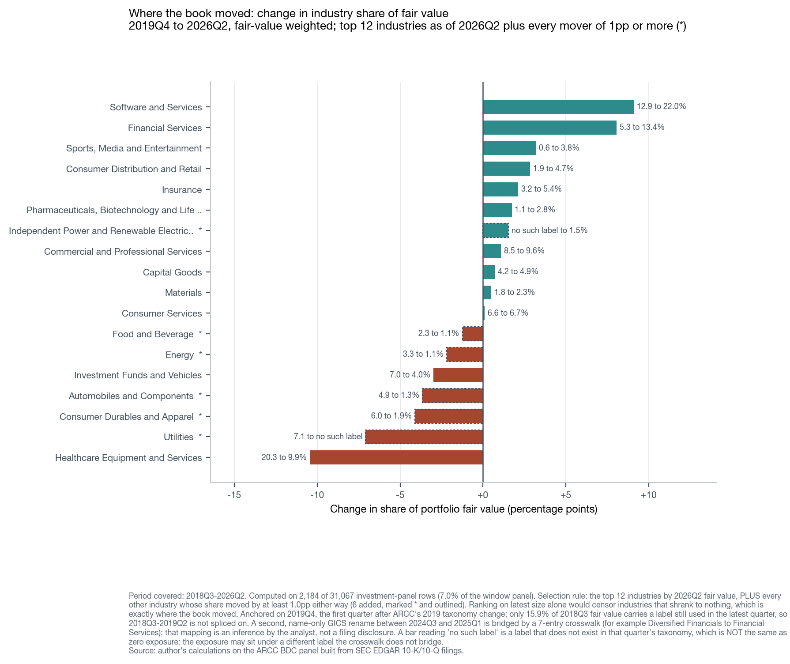

*Period covered: 2018Q3-2026Q2. Computed on 2,184 of 31,067 investment-panel rows (7.0% of the window panel). Selection rule: the top 12 industries by 2026Q2 fair value, PLUS every other industry whose share moved by at least 1.0pp either way (6 added, marked * and outlined). Ranking on latest size alone would censor industries that shrank to nothing, which is exactly where the book moved. Anchored on 2019Q4, the first quarter after ARCC's 2019 taxonomy change; only 15.9% of 2018Q3 fair value carries a label still used in the latest quarter, so 2018Q3-2019Q2 is not spliced on. A second, name-only GICS rename between 2024Q3 and 2025Q1 is bridged by a 7-entry crosswalk (for example Diversified Financials to Financial Services); that mapping is an inference by the analyst, not a filing disclosure. A bar reading 'no such label' is a label that does not exist in that quarter's taxonomy, which is NOT the same as zero exposure: the exposure may sit under a different label the crosswalk does not bridge.*

*Source: author's calculations on the ARCC BDC panel built from SEC EDGAR 10-K/10-Q filings.*

**Table 22. Industry composition of the ARCC book, 2019Q4 vs 2026Q2**

*Period covered: 2018Q3-2026Q2. Computed on 2,184 of 31,067 investment-panel rows (7.0% of the window panel). 1,439 2026Q2 rows and 745 2019Q4 rows. Shares are of each quarter's own total fair value.*

| Industry (normalized)                            |   FV 2026Q2 ($mm) |   Share 2026Q2 (%) |   Share 2019Q4 (%) |   Change (pp) |
|:-------------------------------------------------|------------------:|-------------------:|-------------------:|--------------:|
| Software and Services                            |          6,451.20 |              21.98 |              12.89 |          9.09 |
| Financial Services                               |          3,935.80 |              13.41 |               5.35 |          8.06 |
| Sports, Media and Entertainment                  |          1,121.00 |               3.82 |               0.63 |          3.19 |
| Consumer Distribution and Retail                 |          1,377.60 |               4.69 |               1.87 |          2.83 |
| Insurance                                        |          1,570.50 |               5.35 |               3.24 |          2.11 |
| Pharmaceuticals, Biotechnology and Life Sciences |            835.20 |               2.85 |               1.11 |          1.73 |
| Commercial and Professional Services             |          2,811.90 |               9.58 |               8.50 |          1.08 |
| Capital Goods                                    |          1,437.50 |               4.90 |               4.18 |          0.72 |
| Materials                                        |            672.90 |               2.29 |               1.79 |          0.50 |
| Consumer Services                                |          1,972.10 |               6.72 |               6.62 |          0.10 |
| Investment Funds and Vehicles                    |          1,180.50 |               4.02 |               7.01 |         -2.99 |
| Healthcare Equipment and Services                |          2,895.20 |               9.86 |              20.29 |        -10.42 |

*Note: Fair-value weighted. Labels are common.normalize_industry output (57 normalized labels in window, from 68 raw labels), plus a 7-entry legacy crosswalk applied to the 2019Q4 column only: Diversified Financials to Financial Services; Insurance Services to Insurance; Retailing and Retailing and Distribution to Consumer Distribution and Retail; Media and Entertainment to Sports, Media and Entertainment; Healthcare Services to Healthcare Equipment and Services; Power Generation to Independent Power and Renewable Electricity Producers. The comparison starts at 2019Q4 because the 2019 taxonomy break cannot be bridged by renaming. THIS TABLE RANKS ON LATEST FAIR VALUE, so industries the book exited are not rows in it. The exits of 1pp or more of 2019Q4 fair value are: Utilities 7.1 to 0.0% (-7.1pp); Consumer Durables and Apparel 6.0 to 1.9% (-4.1pp); Automobiles and Components 4.9 to 1.3% (-3.6pp); Energy 3.3 to 1.1% (-2.2pp); Food and Beverage 2.3 to 1.1% (-1.2pp). They are plotted in the companion figure. A latest share of 0.0% can mean the label no longer exists in the taxonomy rather than that the exposure was sold.*

*Source: author's calculations on the ARCC BDC panel built from SEC EDGAR 10-K/10-Q filings.*

The top 12 industries hold 89.48% of 2026Q2 fair value across the 24 labels present in that quarter (23 in 2019Q4; 57 normalized labels appear across the whole window, from 68 raw labels).

## 6.2 Industry concentration

Industry HHI was 935.9 points in 2019Q4 and 1,028.8 points in 2026Q2, within a range of 843.2 (2021Q1) to 1,161.1 (2024Q3), while the top-5 industry share rose from 55.76% to 61.56%. The level is not comparable across the 2019 taxonomy break: HHI moves -116 points, from 1,051.8 in 2019Q2 to 935.9 in 2019Q4, while the bucket count falls from 27 to 23, because the re-bucketing split sectors as well as merging them. Read the pre-2019Q4 and post-2019Q4 segments as two separate series.

**Figure 28. Industry concentration through time**

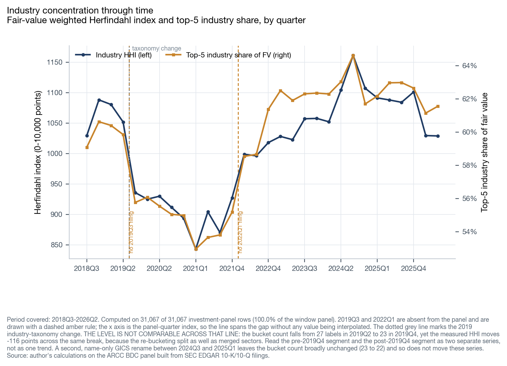

*Period covered: 2018Q3-2026Q2. Computed on 31,067 of 31,067 investment-panel rows (100.0% of the window panel). 2019Q3 and 2022Q1 are absent from the panel and are drawn with a dashed amber rule; the x axis is the panel-quarter index, so the line spans the gap without any value being interpolated. The dotted grey line marks the 2019 industry-taxonomy change. THE LEVEL IS NOT COMPARABLE ACROSS THAT LINE: the bucket count falls from 27 labels in 2019Q2 to 23 in 2019Q4, yet the measured HHI moves -116 points across the same break, because the re-bucketing split as well as merged sectors. Read the pre-2019Q4 segment and the post-2019Q4 segment as two separate series, not as one trend. A second, name-only GICS rename between 2024Q3 and 2025Q1 leaves the bucket count broadly unchanged (23 to 22) and so does not move these series.*

*Source: author's calculations on the ARCC BDC panel built from SEC EDGAR 10-K/10-Q filings.*

## 6.3 Borrower breadth, concentration and persistence

Distinct borrowers rose from 313 in 2018Q3 to 593 in 2026Q2, while the top-10 borrower share of fair value fell from 25.55% to 22.43% (peak 26.97% in 2023Q1) and borrower HHI rose slightly from 135.8 to 145.4 points. Borrower identity is the raw filing string with no fuzzy matching, so a renamed obligor counts as a new borrower and the 313-to-593 growth is an upper bound on true new-obligor growth.

**Figure 29. Borrower breadth and borrower concentration**

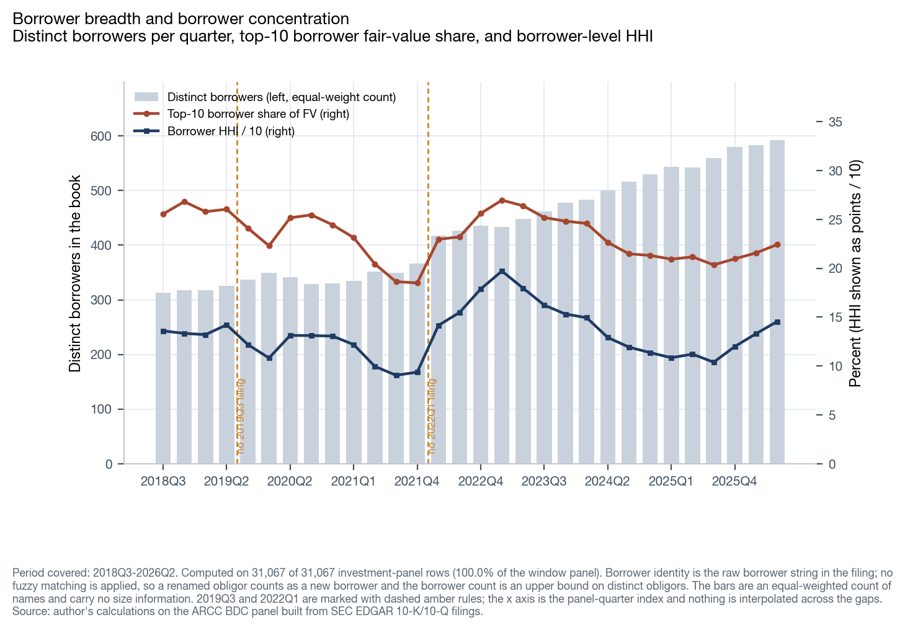

*Period covered: 2018Q3-2026Q2. Computed on 31,067 of 31,067 investment-panel rows (100.0% of the window panel). Borrower identity is the raw borrower string in the filing; no fuzzy matching is applied, so a renamed obligor counts as a new borrower and the borrower count is an upper bound on distinct obligors. The bars are an equal-weighted count of names and carry no size information. 2019Q3 and 2022Q1 are marked with dashed amber rules; the x axis is the panel-quarter index and nothing is interpolated across the gaps.*

*Source: author's calculations on the ARCC BDC panel built from SEC EDGAR 10-K/10-Q filings.*

Across the window 1,331 distinct borrowers appear. The median longest spell is 8 panel quarters and the mean 9.53; 16.60% of borrowers never exceed 2 consecutive panel quarters, 9.47% reach 21 or more, and 33 span all 30. Of the 313 borrowers present in 2018Q3, 38 are still in the book in 2026Q2, and they carry 15.93% of that quarter's fair value. Spells are runs of consecutive panel quarters, so a borrower present either side of an absent quarter counts as continuous; the measure is an upper bound on true continuous tenure, and both panels bin on the longest-ever spell rather than on tenure as at 2026Q2.

**Figure 30. How long a borrower stays in the book**

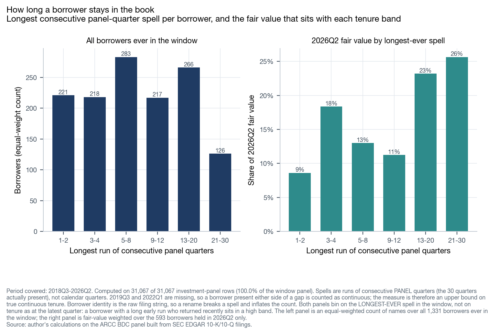

*Period covered: 2018Q3-2026Q2. Computed on 31,067 of 31,067 investment-panel rows (100.0% of the window panel). Spells are runs of consecutive PANEL quarters (the 30 quarters actually present), not calendar quarters. 2019Q3 and 2022Q1 are missing, so a borrower present either side of a gap is counted as continuous; the measure is therefore an upper bound on true continuous tenure. Borrower identity is the raw filing string, so a rename breaks a spell and inflates the count. Both panels bin on the LONGEST-EVER spell in the window, not on tenure as at the latest quarter: a borrower with a long early run who returned recently sits in a high band. The left panel is an equal-weighted count of names over all 1,331 borrowers ever in the window; the right panel is fair-value weighted over the 593 borrowers held in 2026Q2 only.*

*Source: author's calculations on the ARCC BDC panel built from SEC EDGAR 10-K/10-Q filings.*

## 6.4 The largest positions

The 15 largest positions in 2026Q2 carry $6.964bn, 23.73% of the $29.349bn book, on 1.0% of that quarter's 1,439 rows. The largest single position is Ivy Hill Asset Management, L.P equity at $1,896.8mm, 6.46% of the book; Ivy Hill across its 2 positions is 9.69%. Rows are single positions, not borrower aggregates, so one borrower can appear more than once and a borrower's total exposure is larger than any single row shown.

**Table 23. Largest 15 positions by fair value, 2026Q2**

*Period covered: 2018Q3-2026Q2. Computed on 15 of 31,067 investment-panel rows (0.0% of the window panel). The window share above rounds to 0.0% by construction: this is a top-15 cut of one quarter. The meaningful coverage is 15 of the 1,439 positions held in 2026Q2 (1.0% of that quarter's rows), which carry 23.73% of its fair value. Rows are single positions, not borrower aggregates, so one borrower can appear more than once and a borrower's total exposure is larger than any single row shown.*

| Borrower                                                                                           | Industry (normalized)                                 | Type         |   Fair value ($mm) |   FV share of book (%) |   FV / cost (x) | Non-accrual   |
|:---------------------------------------------------------------------------------------------------|:------------------------------------------------------|:-------------|-------------------:|-----------------------:|----------------:|:--------------|
| Ivy Hill Asset Management, L.P                                                                     | Financial Services                                    | equity       |           1,896.80 |                   6.46 |            1.12 | no            |
| Senior Direct Lending Program, LLC                                                                 | Investment Funds and Vehicles                         | subordinated |           1,153.70 |                   3.93 |            1.01 | no            |
| Ivy Hill Asset Management, L.P                                                                     | Financial Services                                    | subordinated |             946.00 |                   3.22 |            1.00 | no            |
| Denali Intermediate Holdings, Inc. and Denali Parent Holdings, L.P                                 | Commercial and Professional Services                  | first lien   |             359.60 |                   1.23 |            0.95 | no            |
| AthenaHealth Group Inc., Minerva Holdco, Inc. and BCPE Co-Invest (A), LP                           | Healthcare Equipment and Services                     | preferred    |             317.80 |                   1.08 |            1.00 | no            |
| FEH Group, LLC                                                                                     | Sports, Media and Entertainment                       | equity       |             266.50 |                   0.91 |            1.48 | no            |
| High Street Buyer, Inc. and High Street Holdco LLC                                                 | Insurance                                             | preferred    |             260.40 |                   0.89 |            1.00 | no            |
| Plaskolite PPC Intermediate II LLC and Plaskolite PPC Blocker LLC                                  | Materials                                             | first lien   |             249.40 |                   0.85 |            0.93 | no            |
| Auctane, Inc                                                                                       | Software and Services                                 | first lien   |             241.60 |                   0.82 |            0.98 | no            |
| Himalaya TopCo LLC and BCPE Hyperlink Holdings, LP                                                 | Healthcare Equipment and Services                     | first lien   |             232.30 |                   0.79 |            0.98 | no            |
| Adonis Bidco Inc                                                                                   | Software and Services                                 | first lien   |             226.70 |                   0.77 |            0.95 | no            |
| Apex Clean Energy TopCo, LLC                                                                       | Independent Power and Renewable Electricity Producers | equity       |             212.50 |                   0.72 |            1.58 | no            |
| Creek Parent, Inc. and Creek Feeder, L.P                                                           | Pharmaceuticals, Biotechnology and Life Sciences      | first lien   |             206.10 |                   0.70 |            1.00 | no            |
| Apex Service Partners, LLC and Apex Service Partners Holdings, LLC                                 | Consumer Services                                     | first lien   |             198.90 |                   0.68 |            1.00 | no            |
| Retained Vantage Data Centers Intermediate Holdco, LP and Retained Vantage Data Centers Assets, LP | Data Centers                                          | subordinated |             195.90 |                   0.67 |            1.00 | no            |

*Note: FV/cost is blank where reported cost is zero or missing. Share denominator is the whole book's fair value in that quarter.*

*Source: author's calculations on the ARCC BDC panel built from SEC EDGAR 10-K/10-Q filings.*

## 6.5 Marks across industries

The whole-book mark in 2026Q2 is 0.9884x fair value over cost, computed on the 1,342 of 1,439 positions with positive cost; the 97 excluded positions carry $17.6mm, 0.06% of book fair value, so the exclusion does not move the level. Within the top 12 industries by fair value, the highest fair-value-weighted mark is Sports, Media and Entertainment at 1.0978x on 55 positions and the lowest is Healthcare Equipment and Services at 0.8832x on 137 positions. Dispersion is a separate question from level and is measured equal-weighted: the widest position-level interquartile range is Investment Funds and Vehicles at 0.579x, but on only 10 positions, and the narrowest is Financial Services at exactly 0.000x, because 65.26% of its priced positions are marked at cost. Across the whole quarter, 47.69% of the 1,342 priced positions are marked exactly at cost.

**Figure 31. Cross-section of marks: fair value against cost by industry**

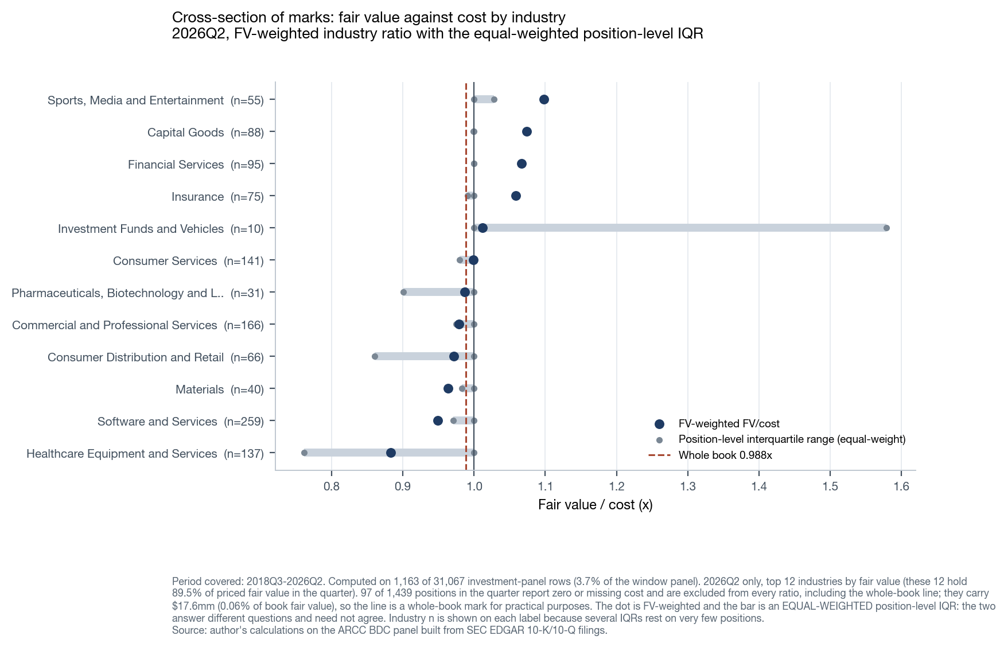

*Period covered: 2018Q3-2026Q2. Computed on 1,163 of 31,067 investment-panel rows (3.7% of the window panel). 2026Q2 only, top 12 industries by fair value (these 12 hold 89.5% of priced fair value in the quarter). 97 of 1,439 positions in the quarter report zero or missing cost and are excluded from every ratio, including the whole-book line; they carry $17.6mm (0.06% of book fair value), so the line is a whole-book mark for practical purposes. The dot is FV-weighted and the bar is an EQUAL-WEIGHTED position-level IQR: the two answer different questions and need not agree. Industry n is shown on each label because several IQRs rest on very few positions.*

*Source: author's calculations on the ARCC BDC panel built from SEC EDGAR 10-K/10-Q filings.*

## 6.6 Where the non-accruals sit

Pooled over the 30 panel quarters, 562 flagged position-quarters carry $11.636bn of cost at $6.120bn of fair value, a 0.526x carrying ratio, and account for 1.88% of the panel's pooled cost. Healthcare is the largest exposure but is split across two taxonomy labels that must be added: Healthcare Services at $2,695.0mm of pooled non-accrual cost plus Healthcare Equipment and Services at $1,211.1mm. The highest non-accrual rate relative to an industry's own pooled cost base is Energy at 9.05%. These are quarter-position dollars, not a single-date exposure: a position on non-accrual for six quarters contributes six rows.

**Figure 32. Which industries carry the non-accruals**

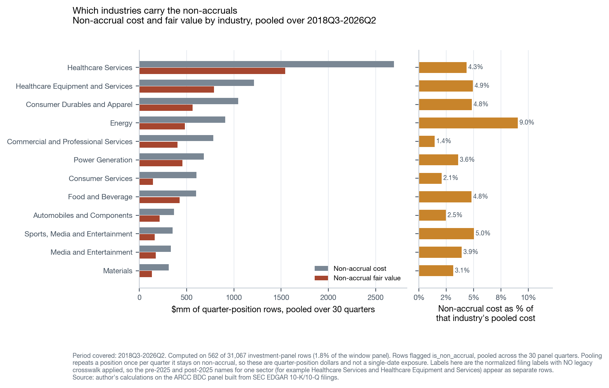

*Period covered: 2018Q3-2026Q2. Computed on 562 of 31,067 investment-panel rows (1.8% of the window panel). Rows flagged is_non_accrual, pooled across the 30 panel quarters. Pooling repeats a position once per quarter it stays on non-accrual, so these are quarter-position dollars and not a single-date exposure. Labels here are the normalized filing labels with NO legacy crosswalk applied, so the pre-2025 and post-2025 names for one sector (for example Healthcare Services and Healthcare Equipment and Services) appear as separate rows.*

*Source: author's calculations on the ARCC BDC panel built from SEC EDGAR 10-K/10-Q filings.*

**Table 24. Non-accrual exposure by industry, pooled 2018Q3-2026Q2**

*Period covered: 2018Q3-2026Q2. Computed on 432 of 31,067 investment-panel rows (1.4% of the window panel). Top 12 industries by pooled non-accrual cost: 432 of the 562 non-accrual rows in the window, carrying 85.04% of pooled non-accrual cost, spread over 30 industries that ever show a non-accrual.*

| Industry (normalized)                |   Non-accrual cost ($mm) |   Non-accrual FV ($mm) |   NA FV / NA cost (x) |   Industry cost ($mm) |   NA rate (% of industry cost) |   NA rows |
|:-------------------------------------|-------------------------:|-----------------------:|----------------------:|----------------------:|-------------------------------:|----------:|
| Healthcare Services                  |                 2,695.00 |               1,541.40 |                  0.57 |             62,017.40 |                           4.35 |       133 |
| Healthcare Equipment and Services    |                 1,211.10 |                 789.80 |                  0.65 |             24,541.50 |                           4.93 |        46 |
| Consumer Durables and Apparel        |                 1,045.80 |                 564.20 |                  0.54 |             21,669.80 |                           4.83 |        20 |
| Energy                               |                   909.00 |                 481.90 |                  0.53 |             10,046.70 |                           9.05 |        22 |
| Commercial and Professional Services |                   783.30 |                 404.20 |                  0.52 |             54,306.40 |                           1.44 |        40 |
| Power Generation                     |                   684.00 |                 456.80 |                  0.67 |             19,013.40 |                           3.60 |        18 |
| Consumer Services                    |                   603.70 |                 142.50 |                  0.24 |             28,887.70 |                           2.09 |        46 |
| Food and Beverage                    |                   600.30 |                 427.40 |                  0.71 |             12,477.50 |                           4.81 |        54 |
| Automobiles and Components           |                   367.80 |                 216.20 |                  0.59 |             14,841.80 |                           2.48 |        24 |
| Sports, Media and Entertainment      |                   352.00 |                 163.80 |                  0.47 |              7,015.90 |                           5.02 |         9 |
| Media and Entertainment              |                   332.30 |                 173.50 |                  0.52 |              8,513.60 |                           3.90 |        10 |
| Materials                            |                   311.60 |                 132.00 |                  0.42 |              9,967.80 |                           3.13 |        10 |

*Note: Quarter-position dollars: a position on non-accrual for six quarters contributes six rows. The rate denominator is the same pooled cost basis for that industry, so numerator and denominator are consistent.*

*Source: author's calculations on the ARCC BDC panel built from SEC EDGAR 10-K/10-Q filings.*

---

# 7. Limitations and methodology

**Data construction.** Two panels were built by parsing ARCC's own 10-K and 10-Q filings from SEC EDGAR: a quarter panel (balance sheet, shares outstanding, debt outstanding) and a position panel (one row per position per quarter, with borrower, industry, investment type, cost, fair value, reference rate, spread, all-in rate, maturity date and non-accrual flag). A filing entered the panel only if it passed a 16-check verification gate, one of whose checks is the balance-sheet identity, applied at a tolerance of the greater of 0.05% of total assets or $1.

1. **Single issuer.** Every figure in this report is ARCC. There is no cross-BDC benchmark anywhere in the dataset, parse errors are not independent of the issuer, and nothing here is a private-credit market statistic. Conclusions about direct lending as a market cannot be drawn from one manager's book.

2. **Gate-excluded filings.** 2019Q3 and 2022Q1 failed the build gate and are absent. Which specific check each failed is not established by this analysis, so the panel's missingness is partly endogenous to the verification step. A separate parser failure on the non-accrual footnote removes 2022Q4, 2023Q4 and 2024Q4 from the non-accrual series only. Nothing is interpolated across any of these holes, and every pooled statistic states the denominator it uses.

3. **Missing not at random.** Rate, spread and maturity fields are absent by construction on equity and preferred positions, and absent more often in older filings. Roughly 28% of the portfolio's fair value in an average quarter carries no usable rate. Every yield and spread exhibit describes the covered subset only, and the uncovered part is systematically the non-coupon part of the book. Two fields are unusable outright: `pct_of_net_assets` (100.00% null) and `shares_units` (81.46% null). NAV per share is derived, not filed, in 27 of the 30 quarters, so it will not tie to ARCC's reported NAV to the cent; the derived 2026Q2 value of $19.35 does match the filed field in the one quarter where both exist.

4. **Taxonomy drift.** The industry field carries 68 raw labels collapsing to 57 normalized ones, with two breaks. The 2019 re-bucketing is real and unbridgeable: only 15.95% of 2018Q3 fair value carries a label still in use in 2026Q2, which is why every composition comparison in Section 6 is anchored on 2019Q4 rather than on the start of the window. The 2024Q3-to-2025Q1 change is a name-only GICS rename bridged by a 7-entry analyst crosswalk applied to the change-in-share exhibits only; that crosswalk is an inference and is incomplete, and a bar reading "no such label" is not the same as zero exposure. The non-accrual exhibits apply no crosswalk at all, so legacy and current sector names appear as separate rows and must be added by the reader.

5. **No market prices and no realized returns.** Fair value is the manager's own estimate as filed. There is no independent price, no bid, no total return, no realized loss series and no IRR anywhere in this dataset. FV/cost is a mark, not a return, and the 0.5839x on non-accrual debt is a carrying value, not a recovery.

6. **Pooling and weighting conventions.** Pooled statistics stack quarter-ends, so a position held for k quarters counts k times; the by-type fair-value column and the non-accrual dollars are position-quarter quantities, not portfolio weights at any single date. Growth rates are endpoint-to-endpoint compound rates over 7.75 elapsed years, not fitted trends, and the 30-point series sit on an irregular grid. Concentration, mix, mark, yield and spread statistics are fair-value weighted; borrower counts, position counts, size percentiles and the position-level interquartile ranges are equal-weighted. 3,283 rows (10.6%) carry exactly $0 of fair value and therefore have zero influence on any fair-value-weighted figure while still counting in equal-weighted ones.

7. **Association, not causation.** No exhibit in this report identifies a causal effect. The spread-versus-marks relationship in Section 5.5 rests on 9 bucket-level points, is non-monotonic, and excludes by construction exactly the positions that went wrong.

---

# 8. Exhibit index

Coverage is stated as the rows the exhibit was computed on, out of the in-window panel it draws from (31,067 investment-panel rows, or 30 quarter-panel rows). Where that share is small the exhibit is a deliberate single-quarter or single-instrument cut, not a discarded sample, and the exhibit's own note gives the meaningful denominator. Every exhibit with a fact sidecar is included in this report; none was dropped.

| Exhibit | Title | Slug | Period | Coverage |
|:--------|:------|:-----|:-------|:---------|
| Figure 1 | Filing coverage: parsed quarters vs the calendar | `m1_filing_coverage` | 2018Q1-2026Q2 calendar grid | 30 of 30 quarter-panel rows (100.0%) |
| Figure 2 | Position count per quarter | `m1_positions_per_quarter` | 2018Q3-2026Q2 | 31,067 of 31,067 investment-panel rows (100.0%) |
| Table 1 | Field completeness: null share by column, in-window investment panel | `m1_null_share_by_column` | 2018Q3-2026Q2 | 31,067 of 31,067 investment-panel rows (100.0%) |
| Table 2 | Missingness by field and by position type | `m2_f_missingness` | 2018Q3-2026Q2 | 31,067 of 31,067 investment-panel rows (100.0%) |
| Figure 3 | Missingness is structural: nulls concentrate in equity and preferred | `m1_missingness_by_investment_type` | 2018Q3-2026Q2 | 31,067 of 31,067 investment-panel rows (100.0%) |
| Table 3 | Null share of rate and term fields by investment type | `m1_missingness_by_investment_type` | 2018Q3-2026Q2 | 31,067 of 31,067 investment-panel rows (100.0%) |
| Figure 4 | The other axis of missingness: filing vintage | `m1_spread_missingness_by_vintage` | 2018Q3-2026Q2 | 31,067 of 31,067 investment-panel rows (100.0%) |
| Figure 5 | Completeness of the four rate and term fields, quarter by quarter | `m1_rate_term_completeness_through_time` | 2018Q3-2026Q2 | 31,067 of 31,067 investment-panel rows (100.0%) |
| Figure 6 | Fair-value-weighted coverage of the rate fields | `m1_fv_weighted_rate_coverage` | 2018Q3-2026Q2 | 31,067 of 31,067 investment-panel rows (100.0%) |
| Table 4 | Fair-value-weighted rate-field coverage by quarter | `m1_fv_weighted_rate_coverage` | 2018Q3-2026Q2 | 31,067 of 31,067 investment-panel rows (100.0%) |
| Table 5 | Balance-sheet identity check: total assets - total liabilities vs net assets | `m1_balance_sheet_identity` | 2018Q3-2026Q2 | 30 of 30 quarter-panel rows (100.0%) |
| Table 6 | Portfolio scale at three snapshots | `m2_a_scale_snapshots` | 2018Q3-2026Q2 | 3 of 30 quarter-panel rows (10.0%) |
| Figure 7 | Balance-sheet scale, ARCC | `m2_a_scale_timeseries` | 2018Q3-2026Q2 | 30 of 30 quarter-panel rows (100.0%) |
| Figure 8 | NAV per share, derived | `m2_a_nav_per_share` | 2018Q3-2026Q2 | 30 of 30 quarter-panel rows (100.0%) |
| Table 7 | Position size at fair value: distribution | `m2_b_position_size_distribution` | 2018Q3-2026Q2 | 31,067 of 31,067 investment-panel rows (100.0%) |
| Figure 9 | Borrower concentration | `m2_b_concentration` | 2018Q3-2026Q2 | 31,067 of 31,067 investment-panel rows (100.0%) |
| Table 8 | Borrower concentration by quarter | `m2_b_concentration_by_quarter` | 2018Q3-2026Q2 | 31,067 of 31,067 investment-panel rows (100.0%) |
| Figure 10 | Aggregate mark: fair value over cost | `m2_c_fv_over_cost` | 2018Q3-2026Q2 | 31,067 of 31,067 investment-panel rows (100.0%) |
| Figure 11 | Markdown tails: positions carried below cost | `m2_c_markdown_tails` | 2018Q3-2026Q2 | 28,432 of 31,067 investment-panel rows (91.5%) |
| Table 9 | Cost versus fair value by quarter | `m2_c_mark_by_quarter` | 2018Q3-2026Q2 | 28,432 of 31,067 investment-panel rows (91.5%) |
| Figure 12 | Non-accrual positions | `m2_d_non_accruals` | 2018Q3-2026Q2 | 27,588 of 31,067 investment-panel rows (88.8%) |
| Table 10 | Non-accruals by quarter | `m2_d_non_accruals_by_quarter` | 2018Q3-2026Q2 | 27,588 of 31,067 investment-panel rows (88.8%) |
| Figure 13 | Effective yield and its coverage | `m2_e_effective_yield` | 2018Q3-2026Q2 | 21,776 of 31,067 investment-panel rows (70.1%) |
| Table 11 | Effective yield by year | `m2_e_yield_by_year` | 2018Q3-2026Q2 | 21,776 of 31,067 investment-panel rows (70.1%) |
| Figure 14 | Balance sheet in levels, quarter by quarter | `ts_growth_levels` | 2018Q3-2026Q2 | 30 of 30 quarter-panel rows (100.0%) |
| Figure 15 | Balance sheet indexed to 100 at 2018Q3 | `ts_growth_indexed` | 2018Q3-2026Q2 | 30 of 30 quarter-panel rows (100.0%) |
| Figure 16 | Leverage: debt to net assets and debt to total assets | `ts_leverage` | 2018Q3-2026Q2 | 30 of 30 quarter-panel rows (100.0%) |
| Table 12 | Leverage and NAV per share by quarter | `ts_leverage_table` | 2018Q3-2026Q2 | 30 of 30 quarter-panel rows (100.0%) |
| Figure 17 | Asset mix drift: fair-value share by investment type | `ts_asset_mix` | 2018Q3-2026Q2 | 31,067 of 31,067 investment-panel rows (100.0%) |
| Figure 18 | Reference-rate mix of the debt book, weighted by fair value | `ts_rate_mix` | 2018Q3-2026Q2 | 21,891 of 31,067 investment-panel, debt-like positions rows (70.5%) |
| Table 13 | Reference-rate mix of the debt book by quarter (FV-weighted) | `ts_rate_mix_table` | 2018Q3-2026Q2 | 21,891 of 31,067 investment-panel, debt-like positions rows (70.5%) |
| Figure 19 | All-in rate and spread on the debt book, fair-value weighted | `ts_yield_spread` | 2018Q3-2026Q2 | 21,891 of 31,067 investment-panel, debt-like positions rows (70.5%) |
| Figure 20 | Credit stress: non-accrual share and aggregate fair value to cost | `ts_credit_stress` | 2018Q3-2026Q2 | 31,067 of 31,067 investment-panel rows (100.0%) |
| Table 14 | Marks and non-accruals by quarter | `ts_credit_stress_table` | 2018Q3-2026Q2 | 31,067 of 31,067 investment-panel rows (100.0%) |
| Figure 21 | Spread by seniority: interquartile range and median | `m4_spread_distribution_by_seniority` | 2018Q3-2026Q2 | 19,009 of 31,067 investment-panel rows (61.2%) |
| Table 15 | Fair-value weighted spread distribution by seniority | `m4_spread_distribution_by_seniority` | 2018Q3-2026Q2 | 19,009 of 31,067 investment-panel rows (61.2%) |
| Figure 22 | Spread by seniority through time, and the second-to-first lien differential | `m4_spread_by_seniority_over_time` | 2018Q3-2026Q2 | 19,009 of 31,067 investment-panel rows (61.2%) |
| Table 16 | Quarterly fair-value weighted median spread by seniority | `m4_spread_by_seniority_over_time` | 2018Q3-2026Q2 | 19,009 of 31,067 investment-panel rows (61.2%) |
| Figure 23 | All-in yield decomposed into spread and implied base rate | `m4_all_in_rate_decomposition` | 2018Q3-2026Q2 | 19,009 of 31,067 investment-panel rows (61.2%) |
| Table 17 | All-in rate, contractual spread and implied base rate by quarter | `m4_all_in_rate_decomposition` | 2018Q3-2026Q2 | 19,009 of 31,067 investment-panel rows (61.2%) |
| Figure 24 | Fixed versus floating share of the debt book | `m4_fixed_vs_floating` | 2018Q3-2026Q2 | 21,891 of 31,067 investment-panel rows (70.5%) |
| Figure 25 | Maturity structure of the debt book | `m4_maturity_structure` | 2018Q3-2026Q2 | 21,388 of 31,067 investment-panel rows (68.8%) |
| Table 18 | Weighted-average tenor and near-dated maturity shares by quarter | `m4_maturity_profile_by_quarter` | 2018Q3-2026Q2 | 21,388 of 31,067 investment-panel rows (68.8%) |
| Table 19 | Maturity ladder of the debt book, 2026Q2 | `m4_maturity_ladder_latest` | 2026Q2 | 1,039 of 31,067 investment-panel rows (3.3%) |
| Figure 26 | Do wider spreads carry worse marks? | `m4_spread_bucket_vs_marks` | 2024Q3-2026Q2 | 7,019 of 31,067 investment-panel rows (22.6%) |
| Table 20 | Marks by spread bucket, latest 8 quarters | `m4_spread_bucket_vs_marks` | 2024Q3-2026Q2 | 7,019 of 31,067 investment-panel rows (22.6%) |
| Table 21 | Marks by accrual status, latest 8 quarters | `m4_accrual_status_vs_marks` | 2024Q3-2026Q2 | 7,532 of 31,067 investment-panel rows (24.2%) |
| Figure 27 | Where the book moved: change in industry share of fair value | `m5_industry_share_change` | 2018Q3-2026Q2 | 2,184 of 31,067 investment-panel rows (7.0%) |
| Table 22 | Industry composition of the ARCC book, 2019Q4 vs 2026Q2 | `m5_industry_composition` | 2018Q3-2026Q2 | 2,184 of 31,067 investment-panel rows (7.0%) |
| Figure 28 | Industry concentration through time | `m5_industry_concentration` | 2018Q3-2026Q2 | 31,067 of 31,067 investment-panel rows (100.0%) |
| Figure 29 | Borrower breadth and borrower concentration | `m5_borrower_concentration` | 2018Q3-2026Q2 | 31,067 of 31,067 investment-panel rows (100.0%) |
| Figure 30 | How long a borrower stays in the book | `m5_borrower_persistence` | 2018Q3-2026Q2 | 31,067 of 31,067 investment-panel rows (100.0%) |
| Table 23 | Largest 15 positions by fair value, 2026Q2 | `m5_top15_positions_latest` | 2018Q3-2026Q2 | 15 of 31,067 investment-panel rows (0.1%) |
| Figure 31 | Cross-section of marks: fair value against cost by industry | `m5_marks_by_industry` | 2018Q3-2026Q2 | 1,163 of 31,067 investment-panel rows (3.7%) |
| Figure 32 | Which industries carry the non-accruals | `m5_nonaccrual_by_industry` | 2018Q3-2026Q2 | 562 of 31,067 investment-panel rows (1.8%) |
| Table 24 | Non-accrual exposure by industry, pooled 2018Q3-2026Q2 | `m5_nonaccrual_by_industry` | 2018Q3-2026Q2 | 432 of 31,067 investment-panel rows (1.4%) |

*Source for all exhibits: author's calculations on the ARCC BDC panel built from SEC EDGAR 10-K/10-Q filings.*
